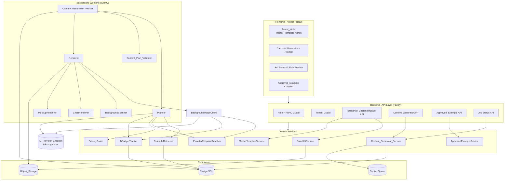
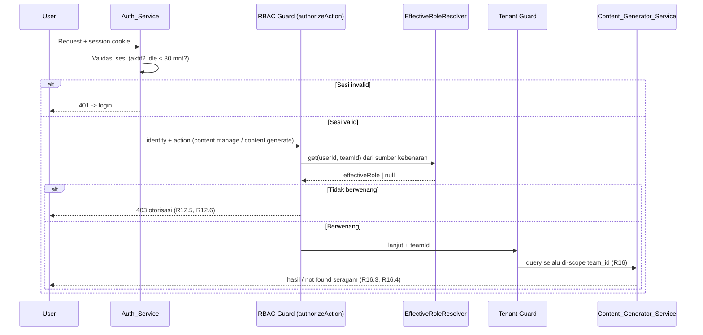
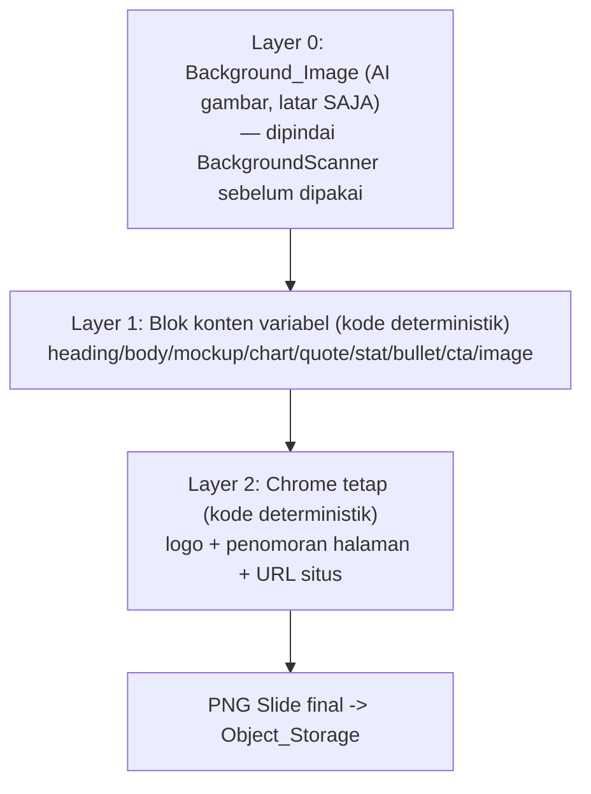
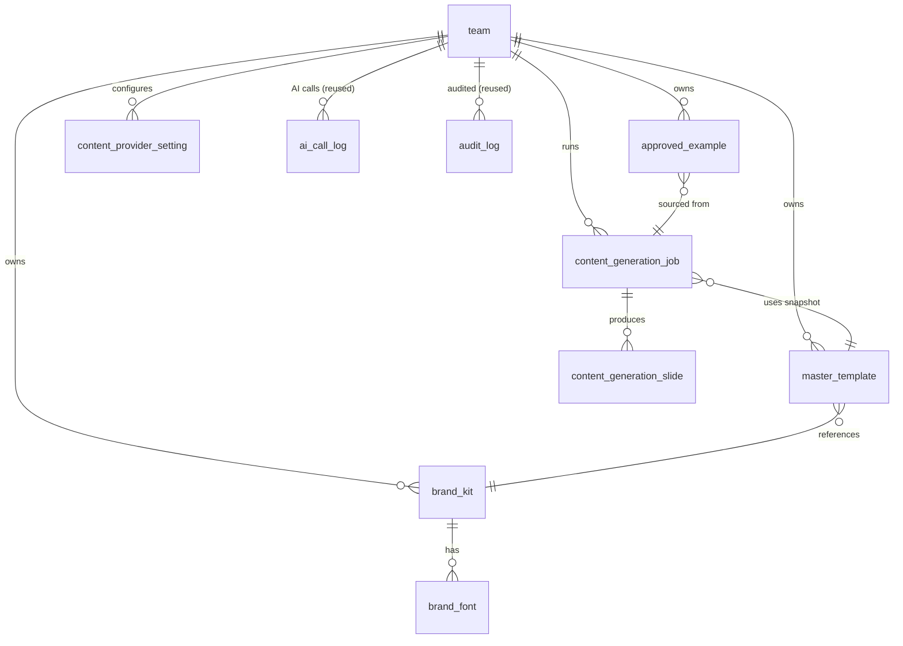

# Dokumen Desain

## Overview

AI Content/Carousel Generator adalah perluasan dari Leads Generation Dashboard yang memungkinkan Team memproduksi materi konten media sosial — caption/copy dan gambar carousel multi-slide — yang **konsisten secara brand** namun **bervariasi secara kreatif** antar-slide. Dokumen ini menerjemahkan 16 requirement (`requirements.md`) menjadi arsitektur teknis konkret di atas stack yang sama dengan dokumen induk: **frontend React/Next.js**, **backend Node.js (TypeScript) + Fastify**, **PostgreSQL**, **BullMQ di atas Redis**, dan **Object_Storage** untuk aset gambar.

Inti desain adalah **pipeline dua tahap yang dapat diuji dan dikendalikan**:

1. **Planner** — memanggil model teks AI_Provider untuk mengubah prompt User + aturan Master_Template + Approved_Example relevan menjadi sebuah **Content_Plan** terstruktur (JSON).
2. **Content_Plan_Validator** — memvalidasi Content_Plan terhadap Content_Plan_Schema dan aturan Master_Template (fail-closed), dengan paling banyak satu kali perbaikan via Planner.
3. **Renderer** — kode deterministik yang merender setiap blok memakai aset Brand_Kit asli (logo, font, warna), menyusun chrome tetap, memindai Background_Image dari AI gambar, lalu mengeluarkan PNG per-slide ke Object_Storage.

Penekanan utama adalah **kesetiaan brand hibrida**: elemen brand yang wajib identik (logo, Brand_Font, warna, chrome) **dirender deterministik oleh kode** dan **tidak pernah digambar oleh model gambar AI**; hanya **latar (Background_Image)** dan **pilihan varian tata letak per-slide** yang boleh bervariasi. Penekanan kedua adalah **kejujuran kegagalan**: sistem tidak pernah menyajikan foto stok acak sebagai keberhasilan AI.

Fitur ini **menggunakan ulang** mekanisme AI dokumen induk (R13): kunci API Gemini terenkripsi per-Team, `AI_Call_Budget` jendela bergulir 30 hari, pencatatan `ai_call_log` + Audit_Log, dan pemrosesan berbasis antrean. Desain ini secara eksplisit **menggantikan (supersede)** implementasi konten ad-hoc yang sudah ada (`content-generator-service.ts`, `content-generator-client.ts`, `content.routes.ts`, tabel `content_template`/`content_template_reference`/`content_generation`) dan **merancang keluar (design out)** cacat-cacatnya — terutama: penyimpulan endpoint dari awalan kunci (`isk-`), fallback foto stok yang disamarkan sebagai sukses, dan fallback Object_Storage ke data-URI base64 / project URL hardcoded.

### Prinsip Desain Utama

| Prinsip | Penjelasan | Requirement terkait |
|---|---|---|
| Kesetiaan brand deterministik | Logo, Brand_Font, warna, dan chrome dirender oleh kode dari Brand_Kit; tidak pernah oleh model gambar AI. | R5, R6, R7 |
| Pemisahan tahap | Planner (teks) → Validator → Renderer (kode) terpisah tegas; AI hanya pada Planner dan Background_Image. | R3, R4, R5 |
| Validasi sebelum render (fail-closed) | Content_Plan dirender hanya setelah lolos validasi; kegagalan validator → job `failed`. | R4, R9.4 |
| Master menang | Master_Template adalah aturan keras; Approved_Example tidak pernah menimpa brand atau melonggarkan aturan. | R8, R9 |
| Kejujuran kegagalan | Slide gagal ditandai `failed`; placeholder hanya pratinjau kegagalan yang terlihat, tidak pernah dihitung sukses. | R5, R10, R11 |
| Slide success ⇒ terunggah | Slide `success` hanya jika PNG dihasilkan **dan** berhasil diunggah ke Object_Storage. | R5.11, R10.5 |
| Fail-fast di tingkat job | Satu slide `failed` → hentikan slide berikutnya, job `failed`, slide selesai dipertahankan tanpa rollback. | R10.3, R11.3 |
| Endpoint sengaja | AI_Provider_Endpoint dikonfigurasi eksplisit per-Team; tidak pernah disimpulkan dari kunci API; HTTPS wajib. | R14 |
| Privasi by design | Hanya masukan brand/konten yang dikirim ke AI; Personal_Data Lead diblokir kecuali disertakan eksplisit. | R15 |
| Anggaran & audit dipakai ulang | Setiap panggilan AI dicek budget (fail-fast), dicatat `ai_call_log` + Audit_Log. | R13 |
| Isolasi data per Team | Setiap artefak konten ber-`team_id`; seluruh query difilter pada lapisan repository (Tenant Guard). | R16 |
| No base64 di DB | Aset Brand_Kit dan PNG slide disimpan sebagai acuan URL Object_Storage, bukan blob base64. | R1.5, R5.9 |

### Pemetaan Requirement ke Komponen

| Requirement | Komponen utama |
|---|---|
| R1 Penyimpanan & pengelolaan Brand_Kit | BrandKitService, ObjectStorage, Audit_Log |
| R2 Penyusunan Master_Template | MasterTemplateService, BrandKitService (validasi acuan) |
| R3 Pembuatan rencana (Planner) | Content_Generator_Service (pemicuan), Planner, ProviderEndpointResolver, AiBudgetTracker |
| R4 Validasi & perbaikan rencana | Content_Plan_Validator, Planner (repair) |
| R5 Rendering deterministik | Renderer, BackgroundImageClient, BackgroundScanner, ObjectStorage |
| R6 Variasi tata letak per-slide | Renderer, SlideLayoutCatalog |
| R7 Chart & mockup | ChartRenderer, MockupRenderer, Content_Generator_Service (precheck data) |
| R8 Kurasi & retrieval contoh | ApprovedExampleService, ExampleRetriever, Planner |
| R9 Aturan master-menang | MasterTemplateService, Content_Plan_Validator |
| R10 Pemrosesan latar belakang & status | Content_Generator_Service, Content_Generation_Worker, queue |
| R11 Penanganan kegagalan jujur | Content_Generation_Worker, Renderer (status per-slide) |
| R12 RBAC konten | RBAC_Matrix (`content.manage`, `content.generate`), authorizeAction |
| R13 Anggaran & audit AI | AiBudgetTracker, AiCallLogRepository, Audit_Log, TeamAiSettingsService |
| R14 Konfigurasi & keamanan endpoint | ProviderEndpointResolver, ContentProviderSettingService, UrlSafetyGuard |
| R15 Privasi masukan AI | PrivacyGuard (AI payload), Audit_Log |
| R16 Isolasi multi-tenant | Tenant-scoped repositories, ObjectStorage (akses ber-Team) |

## Architecture

### Arsitektur Tingkat Tinggi



Catatan keterbacaan: panah `Planner/BackgroundImageClient → AI_Provider_Endpoint` selalu melewati `ProviderEndpointResolver` (R14), `AiBudgetTracker` (R13), dan `PrivacyGuard` (R15) sebelum keluar. Tidak ada jalur lain yang boleh menghubungi AI_Provider.

### Alur Permintaan Berbasis Peran (RBAC + Tenant Guard)

Mengikuti dua lapis penjaga dokumen induk, diperluas dengan aksi konten `content.manage` dan `content.generate`. Peran efektif dibaca per-permintaan via `EffectiveRoleResolver` (R2.3 induk), bukan dari peran sesi yang dibekukan saat login.



### Sequence: Pemicuan & Pemrosesan Carousel

Pemicuan bersifat asinkron (R3.1, R10.1): permintaan HTTP hanya memvalidasi prasyarat, membuat `content_generation_job` berstatus `pending`, mengantrekan job, lalu segera kembali. Seluruh panggilan AI terjadi di worker.

```mermaid
sequenceDiagram
    participant M as Member (HTTP)
    participant CGS as Content_Generator_Service
    participant Q as BullMQ Queue
    participant W as Content_Generation_Worker
    participant PL as Planner
    participant V as Content_Plan_Validator
    participant R as Renderer
    participant OS as Object_Storage

    M->>CGS: POST /generate (prompt, slides, data chart/mockup)
    CGS->>CGS: Validasi prapemicu (prompt 1..2000, Master_Template ada,<br/>kunci Gemini ada) — kumpulkan SEMUA error (R3.6, R3.7, R3.8, R13.5)
    alt Ada pelanggaran prasyarat
        CGS-->>M: 422 VALIDATION (seluruh pesan)
    else Lolos
        CGS->>CGS: buat job pending + persist input (R10.1)
        CGS->>Q: enqueue(jobId)
        CGS-->>M: 202 { jobId, status: pending }
    end

    Q->>W: job
    W->>PL: plan(prompt, master, examples)
    PL->>PL: budget precheck + privacy guard + endpoint resolve (R13.4, R15, R14)
    PL-->>W: Content_Plan (JSON) | gagal (budget/endpoint/privacy)
    W->>V: validate(plan, master)
    alt Invalid
        V->>PL: repair (maks 1x) (R4.3)
        PL-->>V: plan'
        V->>V: validate(plan', master)
        alt Tetap invalid / validator error
            V-->>W: job failed (validation_error) (R4.4, R9.4)
        end
    end
    V-->>W: plan valid
    W->>W: precheck data chart/mockup per slide (R7.4)
    loop tiap slide (fail-fast R10.3)
        W->>R: renderSlide(slide, brandKit)
        R->>R: render chrome+blok deterministik; chart/mockup dari data
        R->>R: minta + scan Background_Image (R5.5, R5.6)
        R->>R: cek kontras/overflow/collision -> fallback layout (R5.7)
        R->>OS: upload PNG (R5.8)
        alt PNG dibuat & terunggah
            R-->>W: slide success (+ flag fallback bila ada) (R5.11, R11.4)
        else gagal render/scan/upload
            R-->>W: slide failed (reason)
            W->>W: hentikan slide berikutnya, job failed (R10.3, R11.3)
        end
    end
    W->>W: semua slide success -> job success (R10.4)
```

### Pilihan Teknologi & Alasan (Renderer)

Lapisan rendering deterministik adalah inti fitur ini. Desain merekomendasikan secara **jujur** kombinasi berikut, dengan tradeoff yang disebut eksplisit:

- **Mesin layout teks/chrome: `satori` + `resvg-js`.** `satori` mengubah pohon JSX/HTML+CSS (flexbox subset) menjadi SVG dengan font yang **disuplai eksplisit** (Brand_Font `.ttf`/`.otf` di-load sebagai buffer), lalu `resvg-js` merasterisasi SVG → PNG. Keunggulan: tata letak deklaratif yang cocok untuk varian `Slide_Layout`, kontrol penuh atas penempatan teks/logo, font embedding deterministik. Tradeoff: `satori` mendukung subset CSS (flexbox, tanpa grid penuh), sehingga katalog `Slide_Layout` dirancang dalam batasan flexbox; efek tipografi lanjutan terbatas.
  - **Alternatif: `sharp` / `node-canvas` compositing.** Lebih rendah-level (menggambar rect/teks/gambar langsung), kontrol piksel penuh dan cepat untuk compositing layer, tetapi penataan teks multi-baris dan auto-fit jauh lebih manual. Dipakai sebagai **lapisan compositing akhir** (menyusun background + layer konten SVG/PNG + chrome) dan untuk **pemeriksaan piksel** (kontras, deteksi area). Referensi: [satori](https://github.com/vercel/satori), [resvg-js](https://github.com/yisibl/resvg-js), [sharp](https://sharp.pixelplumbing.com/). *Konten dirangkum ulang untuk kepatuhan lisensi.*
- **Mesin chart: render ke SVG lalu rasterisasi.** Chart digambar dari data User memakai pustaka chart yang menghasilkan SVG (mis. generator SVG berbasis `d3-shape`/`vega-lite`-to-SVG), lalu dirasterisasi dengan `resvg-js`. Keunggulan: deterministik, tajam pada skala apa pun, tanpa headless browser. Tradeoff: cakupan jenis chart terbatas pada yang didukung generator; jenis kompleks dapat ditambah belakangan.
- **Mockup: compositing gambar User.** Berkas gambar mockup yang disediakan User di-`sharp`-resize/clip ke frame perangkat preset; tidak ada AI gambar.
- **Background_Image: `BackgroundImageClient`** memanggil model gambar AI_Provider yang menerima **reference image** (Opsi B) untuk panduan gaya **latar saja**. Hasil dipindai `BackgroundScanner` sebelum compositing.

Pemilihan `satori`/`resvg-js`/`sharp` (Node-native, tanpa Chromium) penting agar Renderer dapat berjalan **deterministik di dalam worker** tanpa beban headless browser, mendukung properti kebenaran "chrome identik antar-slide" dan "chart deterministik dari data".

### Strategi Kesetiaan Brand Hibrida (Opsi A + Opsi B)

Setiap Slide disusun sebagai tumpukan layer tetap:



- **Opsi A (deterministik)**: Layer 1 & 2 selalu dirender kode dari Brand_Kit asli. Warna hanya dari daftar warna brand; teks hanya dengan Brand_Font; chrome identik di seluruh slide.
- **Opsi B (referensi gaya)**: Layer 0 dihasilkan model gambar yang menerima reference image untuk gaya, **tetapi hanya latar** (tanpa teks/logo/angka/chart/mockup). `BackgroundScanner` aktif menolak background yang memuat teks/logo.
- **Kebebasan tata letak v1 = varian preset**: pemilihan `Slide_Layout` per tipe komposisi slide diambil dari `SlideLayoutCatalog` (lihat Data Models). Approved_Example memengaruhi **pemilihan varian dan komposisi blok saja**, tidak pernah brand.

## Components and Interfaces

Antarmuka ditulis sebagai signatur TypeScript untuk menyampaikan kontrak. Tipe `Result<T>` dan `AppError` dipakai ulang dari `@leads-generator/shared` (lihat dokumen induk): `Result<T> = { ok: true; value: T } | { ok: false; error: AppError }`. Semua service ber-`teamId` sebagai argumen pertama (Tenant Guard, R16). `AppError` diperluas pada Error Handling dengan kode domain konten.

### Aksi RBAC & Tipe Bersama (R12)

```typescript
// Perluasan Action di shared/src/auth.ts — ditambahkan untuk fitur ini.
type Action =
  | /* ...aksi induk... */
  | 'content.manage'    // Brand_Kit, Master_Template, approve/unapprove Example (Admin)
  | 'content.generate'; // pemicuan pembuatan Carousel (Admin + Member)
// Pembacaan Carousel/status memakai aksi baca eksisting (tidak butuh content.*).

type AspectRatio = '1:1' | '4:5' | '9:16';
type BlockType =
  | 'heading' | 'body' | 'mockup' | 'chart'
  | 'quote' | 'stat' | 'bullet' | 'cta' | 'image';
type JobStatus = 'pending' | 'success' | 'failed';
type SlideStatus = 'pending' | 'success' | 'failed';

// Alasan kegagalan terstandardisasi (lihat Error Handling).
type FailureReason =
  | 'validation_error' | 'budget_exceeded' | 'endpoint_mismatch'
  | 'insecure_transport' | 'privacy_violation' | 'background_unclean'
  | 'missing_chart_data' | 'missing_mockup' | 'upload_failed'
  | 'off_brand' | 'provider_error' | 'timeout' | 'layout_unsatisfiable';
```

### BrandKitService (R1, R16)

```typescript
interface BrandColor { hex: string; } // divalidasi heksadesimal valid (#RGB/#RRGGBB)

interface ChromeDefinition {
  logoPlacement: 'top-left' | 'top-right' | 'bottom-left' | 'bottom-right' | 'bottom-center';
  pageNumberFormat: string;  // mis. "{n}/{total}"
  siteUrl: string;           // ditampilkan pada chrome
}

interface BrandFontInput { bytes: Buffer; family: string; weight?: number; style?: 'normal' | 'italic'; format: 'ttf' | 'otf'; }
interface BrandKitInput {
  logo: { bytes: Buffer; contentType: string };  // wajib PNG transparan <=5MB
  fonts: BrandFontInput[];                        // >=1, tiap berkas <=5MB
  colors: string[];                               // >=1 hex valid
  chrome: ChromeDefinition;
}

interface BrandKit {
  id: string; teamId: string;
  logoUrl: string;                 // acuan Object_Storage (R1.5)
  fonts: { id: string; url: string; family: string; weight?: number; style?: string }[];
  colors: string[];
  chrome: ChromeDefinition;
  updatedAt: Date;
}

interface BrandKitService {
  // R1.1/R1.3/R1.4: validasi semua aset; tolak tanpa partial-save; kumpulkan seluruh pesan.
  save(teamId: string, actorId: string, input: BrandKitInput): Promise<Result<BrandKit>>;
  get(teamId: string): Promise<Result<BrandKit | null>>;     // R16.2
}
```

Aturan `save` (deterministik, mengumpulkan SELURUH pelanggaran sebelum menolak — R1.3/R1.4): logo harus PNG transparan ≤ 5 MB; tiap Brand_Font `.ttf`/`.otf` ≤ 5 MB; ≥ 1 warna heksadesimal valid; chrome lengkap. Unggahan ke Object_Storage hanya dilakukan **setelah** seluruh validasi lolos; bila satu unggahan gagal, seluruh operasi gagal tanpa menyimpan acuan apa pun (tanpa partial-save) dan tanpa menulis ke DB (R1.3). Audit_Log ditulis dalam transaksi yang sama (R1.1).

### MasterTemplateService (R2, R9)

```typescript
interface TextLengthLimit { blockType: BlockType; maxChars: number; }

interface MasterTemplate {
  id: string; teamId: string;
  brandKitId: string;             // wajib mengacu Brand_Kit Team (R2.1, R2.4)
  allowedBlocks: BlockType[];     // subset dari 9 tipe (R2.1)
  maxSlides: number;              // 1..10 (R2.1)
  textLimits: TextLengthLimit[];  // batas panjang per blok
  aspectRatios: AspectRatio[];    // >=1 dari {1:1,4:5,9:16}
  defaultTone: string;            // nada bawaan (R2.2)
  updatedAt: Date;
}

interface MasterTemplateService {
  // R2.1/R2.3/R2.4: validasi acuan Brand_Kit ada, blok subset, slide 1..10, >=1 rasio.
  save(teamId: string, actorId: string, input: Omit<MasterTemplate, 'id' | 'teamId' | 'updatedAt'>): Promise<Result<MasterTemplate>>;
  get(teamId: string): Promise<Result<MasterTemplate | null>>;
  // Sumber kebenaran aturan keras yang dipakai Planner & Validator.
  rules(teamId: string): Promise<Result<MasterTemplateRules>>;
}

interface MasterTemplateRules {
  allowedBlocks: ReadonlySet<BlockType>;
  maxSlides: number;
  textLimits: ReadonlyMap<BlockType, number>;
  aspectRatios: ReadonlySet<AspectRatio>;
  defaultTone: string;
  brandKitId: string;
}
```

### Content_Plan (kontrak JSON) & Planner (R3, R7, R8)

```typescript
interface ContentPlanBlock {
  type: BlockType;
  text?: string;                  // untuk heading/body/quote/stat/bullet/cta
  chartDataRef?: string;          // id referensi ke data chart yang disuplai User (R7.3)
  mockupRef?: string;             // id referensi ke berkas mockup yang disuplai User (R7.3)
  imageRef?: string;              // id referensi gambar User (tipe 'image')
}

interface ContentPlanSlide {
  index: number;                  // 0-based, berurutan
  layoutVariantHint?: string;     // saran varian dari katalog (boleh diabaikan Renderer)
  blocks: ContentPlanBlock[];     // komposisi blok slide (R6.3)
}

interface ContentPlan {
  aspectRatio: AspectRatio;
  slides: ContentPlanSlide[];     // jumlah <= maxSlides (R3.3, R4)
}

interface PlannerInput {
  teamId: string;
  jobId: string;
  prompt: string;
  rules: MasterTemplateRules;
  examples: ApprovedExampleStructure[]; // few-shot relevan (boleh kosong)
  requestedSlideCount?: number;          // bila prompt menentukan (R3.3)
  expectsData?: boolean;                 // prompt minta data/angka -> butuh chart|stat (R3.4)
  repairOf?: ContentPlan;                // diisi saat percobaan perbaikan (R4.3)
  validationErrors?: string[];           // umpan balik untuk repair
}

interface Planner {
  // Memanggil model teks via AI_Provider_Endpoint. Timeout 30s/panggilan (R3.5).
  // WAJIB lewat budget precheck + privacy guard + endpoint resolver sebelum call.
  plan(input: PlannerInput, signal: AbortSignal): Promise<Result<ContentPlan, PlannerError>>;
}

// Membedakan kegagalan supaya worker memetakan ke FailureReason yang tepat.
type PlannerError =
  | { kind: 'non_json' }                   // keluaran bukan JSON (R4.5)
  | { kind: 'budget_exceeded' }
  | { kind: 'endpoint_mismatch' }
  | { kind: 'insecure_transport' }
  | { kind: 'privacy_violation' }
  | { kind: 'timeout' }
  | { kind: 'provider_error'; message: string };
```

Planner **hanya menandai** kebutuhan chart/mockup melalui `chartDataRef`/`mockupRef` dan **tidak pernah mengarang** nilai data atau isi mockup (R7.3). Jika `expectsData` benar, Planner wajib menyertakan ≥ 1 blok `chart` atau `stat` (R3.4). Approved_Example hanya memengaruhi `layoutVariantHint` dan komposisi `blocks`, bukan warna/logo/font (R8.3).

### Content_Plan_Validator (R4, R9)

```typescript
interface ValidationOutcome {
  valid: boolean;
  errors: string[];               // kosong saat valid
}

interface ContentPlanValidator {
  // R4.1/R4.2: validasi terhadap Content_Plan_Schema + aturan Master_Template.
  // Non-JSON ditangani di Planner (PlannerError.non_json) lalu diperlakukan invalid (R4.5).
  validate(plan: ContentPlan, rules: MasterTemplateRules): ValidationOutcome;
}
```

Validator memeriksa: setiap blok ∈ `allowedBlocks`; `slides.length ≤ maxSlides`; panjang teks per blok ≤ batas; rasio aspek ∈ `aspectRatios`; konsistensi referensi (blok `chart` punya `chartDataRef`, `mockup` punya `mockupRef`). Validator **murni dan deterministik** (tanpa I/O), sehingga kegagalan eksekusinya hanya dapat berasal dari kondisi tak terduga; bila terjadi, worker memperlakukannya fail-closed → `validation_error` (R9.4).

### Renderer, BackgroundImageClient, ChartRenderer, MockupRenderer (R5, R6, R7)

```typescript
interface RenderContext {
  teamId: string; jobId: string;
  brandKit: BrandKit;
  aspectRatio: AspectRatio;
  totalSlides: number;
  // Data yang disuplai User, di-resolve dari referensi pada Content_Plan.
  chartData: ReadonlyMap<string, ChartData>;   // key = chartDataRef
  mockupImages: ReadonlyMap<string, Buffer>;    // key = mockupRef
  userImages: ReadonlyMap<string, Buffer>;      // key = imageRef
}

interface RenderedSlide {
  index: number;
  status: SlideStatus;
  imageUrl?: string;              // hanya saat success (R5.8, R5.11)
  usedFallbackLayout: boolean;    // R11.4 (terbedakan dari success tanpa fallback)
  reason?: FailureReason;         // saat failed (R5.10, R10.5)
}

interface Renderer {
  // Merender satu Slide secara deterministik. success HANYA jika PNG dibuat
  // DAN terunggah (R5.11). Tidak pernah meng-compositing background bermasalah (R5.6).
  renderSlide(slide: ContentPlanSlide, ctx: RenderContext): Promise<RenderedSlide>;
}

interface ChartData { kind: 'bar' | 'line' | 'pie'; series: { label: string; value: number }[]; }
interface ChartRenderer {
  // Deterministik dari data User -> SVG -> PNG/Buffer. Tanpa AI gambar (R7.1).
  render(data: ChartData, palette: string[], size: { w: number; h: number }): Buffer;
}

interface MockupRenderer {
  // Compositing gambar User ke frame perangkat preset. Tanpa AI gambar (R7.2).
  render(image: Buffer, frame: 'phone' | 'browser' | 'plain', size: { w: number; h: number }): Buffer;
}

interface BackgroundRequest {
  prompt: string;                 // deskripsi latar (tanpa instruksi teks/logo)
  aspectRatio: AspectRatio;
  referenceImageUrl?: string;     // Opsi B: panduan gaya (divalidasi UrlSafetyGuard)
  palette: string[];              // warna brand untuk fallback latar polos
}
interface BackgroundImageClient {
  // Memanggil model gambar via AI_Provider_Endpoint (budget + endpoint + privacy guard).
  generate(teamId: string, req: BackgroundRequest, signal: AbortSignal): Promise<Result<Buffer, PlannerError>>;
}

interface BackgroundScanner {
  // Memindai aktif teks/logo pada Background_Image sebelum compositing (R5.5).
  // clean=false -> Renderer menerapkan fallback (regenerasi / latar polos brand) (R5.6).
  scan(image: Buffer): Promise<{ clean: boolean; detected: ('text' | 'logo')[] }>;
}
```

Algoritma fallback Renderer (R5.6, R5.7, R5.10): jika `BackgroundScanner` melaporkan tidak bersih → coba regenerasi 1× → jika tetap tidak bersih, pakai latar polos berwarna brand; jika kontras < 4.5:1 / overflow / collision / batasan layout lain tidak terpenuhi → pakai `Slide_Layout` bawaan dan tandai `usedFallbackLayout=true`; jika seluruh jalur fallback gagal → slide `failed` dengan `reason` (`background_unclean`/`off_brand`/`layout_unsatisfiable`) dan **tidak pernah** meng-compositing background bermasalah. Chrome/warna/font yang tidak dapat dihormati → slide `failed` (`off_brand`), bukan render menyimpang (R6.6).

### ApprovedExampleService & ExampleRetriever (R8)

```typescript
interface ApprovedExampleStructure {
  aspectRatio: AspectRatio;
  tags: string[];
  slides: { blocks: BlockType[]; layoutVariant?: string }[]; // STRUKTUR saja (JSON), tanpa brand
}

interface ApprovedExample {
  id: string; teamId: string;
  structure: ApprovedExampleStructure;
  sourceJobId: string;
  createdAt: Date;
}

interface ApprovedExampleService {
  approve(teamId: string, actorId: string, jobId: string): Promise<Result<ApprovedExample>>;  // R8.1
  unapprove(teamId: string, actorId: string, exampleId: string): Promise<Result<void>>;        // R8.6
  list(teamId: string): Promise<Result<ApprovedExample[]>>;                                     // R16
}

interface ExampleRetriever {
  // Relevansi sederhana & dapat dijelaskan (BUKAN embedding): skor kesamaan
  // berdasarkan kecocokan tags, kesamaan aspect-ratio, dan irisan himpunan blok.
  // Mengembalikan top-N (default 3) di atas ambang; [] jika tidak ada yang relevan (R8.7).
  topRelevant(teamId: string, query: RetrievalQuery, n?: number): Promise<ApprovedExampleStructure[]>;
}

interface RetrievalQuery { aspectRatio: AspectRatio; tags: string[]; intendedBlocks: BlockType[]; }
```

Relevansi (eksplisit, hindari over-engineering): `score = wTag * jaccard(tags) + wAspect * (aspectRatio cocok ? 1 : 0) + wBlock * jaccard(blockSets)`. Hanya contoh dengan `score ≥ threshold` yang disuntikkan; bila kosong → Planner berjalan Master-only (R8.4, R8.7). Embedding vektor bersifat opsional/masa depan dan tidak diperlukan v1.

### ProviderEndpointResolver & ContentProviderSettingService (R14)

```typescript
type ProviderKind = 'google_official' | 'third_party_proxy';

interface ProviderSetting {
  teamId: string;
  kind: ProviderKind;
  baseUrl: string;                // default: https://generativelanguage.googleapis.com
}

interface ContentProviderSettingService {
  // Admin-only (content.manage). Mengonfigurasi endpoint secara eksplisit (R14.1, R14.2).
  set(teamId: string, actorId: string, setting: Omit<ProviderSetting, 'teamId'>): Promise<Result<ProviderSetting>>;
  get(teamId: string): Promise<Result<ProviderSetting>>; // default google_official bila belum diset
}

interface ProviderEndpointResolver {
  // Menentukan endpoint dari SETELAN TERSIMPAN saja; TIDAK PERNAH dari awalan kunci API (R14.1).
  resolve(teamId: string): Promise<Result<ResolvedEndpoint>>;
}

interface ResolvedEndpoint {
  baseUrl: string;
  // Memvalidasi tujuan panggilan sebelum keluar (R14.3, R14.4, R14.5).
  // - skema wajib https -> else insecure_transport
  // - host harus == host yang dikonfigurasi -> else endpoint_mismatch
  assertAllowed(targetUrl: string): Result<void, { code: 'endpoint_mismatch' | 'insecure_transport' }>;
}
```

`ProviderEndpointResolver.resolve` membaca `content_provider_setting` (lihat Data Models) — bukan awalan kunci. Ini **merancang keluar** cabang `this.apiKey.startsWith('isk-')` pada `gemini-client.ts`/`content-generator-client.ts`. Setiap perubahan endpoint dicatat Audit_Log (R14.2), dan setiap panggilan mencatat tujuannya (R14.6).

### PrivacyGuard & UrlSafetyGuard (R15, keamanan URL)

```typescript
interface AiPayload {
  teamId: string;
  fields: Record<string, unknown>; // hanya prompt/master/example/brand assets
}
interface PrivacyGuard {
  // Memastikan payload AI hanya memuat masukan brand/konten yang dikehendaki (R15.1).
  // Memblokir bila terdeteksi Personal_Data Lead tanpa penyertaan eksplisit User (R15.2, R15.3).
  assertNoLeadPII(payload: AiPayload, explicitlyIncludedByUser: boolean): Result<void, { code: 'privacy_violation' }>;
}

interface UrlSafetyGuard {
  // Untuk URL yang disuplai User (reference image, mockup eksternal). Mencegah SSRF.
  // - skema wajib https; tolak http/file/data/gopher/dll.
  // - resolusi DNS diblokir bila private/loopback/link-local/metadata (169.254.169.254).
  // - batas ukuran & content-type (image/*); timeout fetch.
  fetchSafely(url: string, opts: { maxBytes: number; allow: string[]; timeoutMs: number }): Promise<Result<{ bytes: Buffer; contentType: string }>>;
}
```

`PrivacyGuard` memblokir panggilan **sebelum** keluar dan mencatat peristiwa keamanan ke Audit_Log **tanpa** menulis Personal_Data (R15.4). `UrlSafetyGuard` dipakai oleh `BackgroundImageClient` (reference image) dan jalur unggah mockup yang berasal dari URL.

### Content_Generator_Service & Worker (R3, R10, R11)

```typescript
interface GenerateRequest {
  prompt: string;                         // 1..2000 setelah trim (R3.6)
  aspectRatio: AspectRatio;
  requestedSlideCount?: number;
  // Data User di-upload terlebih dulu (mockup/image lewat UrlSafetyGuard / multipart);
  // di sini hanya acuannya untuk dipetakan ke chartDataRef/mockupRef/imageRef.
  chartData?: { ref: string; data: ChartData }[];
  mockups?: { ref: string; objectUrl: string }[];
  images?: { ref: string; objectUrl: string }[];
}

interface JobView {
  jobId: string; status: JobStatus; reason?: FailureReason;
  slides: { index: number; status: SlideStatus; imageUrl?: string; usedFallbackLayout: boolean; reason?: FailureReason }[];
}

interface ContentGeneratorService {
  // Sinkron: validasi prasyarat, buat job pending, enqueue, kembali (R3.1, R10.1).
  // Mengumpulkan SEMUA error prasyarat (R3.8).
  trigger(teamId: string, actorId: string, req: GenerateRequest): Promise<Result<{ jobId: string }>>;
  // R10.6/R16: status keseluruhan + per-slide, di-scope team.
  getJob(teamId: string, jobId: string): Promise<Result<JobView>>;
}

interface ContentGenerationWorker {
  // Konsumen BullMQ: Planner -> Validator -> (repair) -> precheck data -> Renderer per slide.
  // Fail-fast antar-slide (R10.3); job success hanya bila semua slide success (R10.4).
  process(jobId: string): Promise<void>;
}
```

### ObjectStorage (R1.5, R5.8, R5.9, R16.5)

```typescript
interface ObjectStorage {
  // Mengunggah dan mengembalikan acuan URL. GAGAL-KERAS bila kredensial hilang
  // atau unggahan gagal — TIDAK PERNAH fallback ke data-URI base64 atau project URL
  // hardcoded (mendesain keluar cacat supabase-storage.ts). (R1.5, R5.9, R5.11)
  upload(teamId: string, key: string, bytes: Buffer, contentType: string): Promise<Result<string>>;
  // Akses dibatasi ke Team pemilik; lintas-Team -> not found seragam (R16.4, R16.5).
  resolveForTeam(teamId: string, objectUrl: string): Promise<Result<string>>;
}
```

`ObjectStorage.upload` mengembalikan `{ ok: false, error: { code: 'INTERNAL' | 'CONFLICT' } }` saat gagal; pemanggil (BrandKitService, Renderer) menerjemahkannya ke `upload_failed`. Kunci objek di-namespace per-Team (`{teamId}/brand-kit/...`, `{teamId}/jobs/{jobId}/slide-{n}.png`) untuk mendukung isolasi (R16.5).

## Data Models

### Diagram Relasi Entitas



### Skema PostgreSQL

Konvensi mengikuti dokumen induk: setiap tabel ber-tenant punya `team_id uuid NOT NULL REFERENCES team(id)`; difilter di lapisan repository (R16). Tidak ada blob base64 — hanya acuan URL Object_Storage (R1.5, R5.9). `CHECK` constraint menegakkan batas domain.

```sql
-- ====== Brand_Kit (R1) ======
CREATE TABLE brand_kit (
  id          uuid PRIMARY KEY DEFAULT gen_random_uuid(),
  team_id     uuid NOT NULL REFERENCES team(id) ON DELETE CASCADE,
  logo_url    text NOT NULL,                       -- acuan Object_Storage (R1.5), bukan base64
  colors      jsonb NOT NULL,                      -- array hex tervalidasi aplikasi, >=1 (R1.1, R1.4)
  chrome      jsonb NOT NULL,                       -- { logoPlacement, pageNumberFormat, siteUrl } (R1.2)
  updated_at  timestamptz NOT NULL DEFAULT now(),
  CONSTRAINT brand_kit_colors_nonempty CHECK (jsonb_array_length(colors) >= 1),
  -- satu Brand_Kit aktif per Team (penyederhanaan v1)
  CONSTRAINT uniq_brand_kit_team UNIQUE (team_id)
);

CREATE TABLE brand_font (
  id            uuid PRIMARY KEY DEFAULT gen_random_uuid(),
  brand_kit_id  uuid NOT NULL REFERENCES brand_kit(id) ON DELETE CASCADE,
  url           text NOT NULL,                      -- acuan Object_Storage (R1.5)
  family        text NOT NULL,
  weight        integer,
  style         text CHECK (style IS NULL OR style IN ('normal','italic')),
  format        text NOT NULL CHECK (format IN ('ttf','otf')),  -- R1.3
  created_at    timestamptz NOT NULL DEFAULT now()
);
CREATE INDEX idx_brand_font_kit ON brand_font(brand_kit_id);

-- ====== Master_Template (R2) — menggantikan content_template ad-hoc ======
CREATE TABLE master_template (
  id              uuid PRIMARY KEY DEFAULT gen_random_uuid(),
  team_id         uuid NOT NULL REFERENCES team(id) ON DELETE CASCADE,
  brand_kit_id    uuid NOT NULL REFERENCES brand_kit(id),          -- R2.1, R2.4
  allowed_blocks  jsonb NOT NULL,                                   -- subset 9 tipe (R2.1)
  max_slides      integer NOT NULL CHECK (max_slides BETWEEN 1 AND 10),  -- R2.1, R2.3
  text_limits     jsonb NOT NULL DEFAULT '[]',                      -- [{blockType,maxChars}]
  aspect_ratios   jsonb NOT NULL,                                   -- subset {1:1,4:5,9:16}, >=1
  default_tone    text NOT NULL DEFAULT '',                         -- R2.2
  updated_at      timestamptz NOT NULL DEFAULT now(),
  CONSTRAINT master_template_blocks_nonempty CHECK (jsonb_array_length(allowed_blocks) >= 1),
  CONSTRAINT master_template_ratios_nonempty CHECK (jsonb_array_length(aspect_ratios) >= 1),
  CONSTRAINT uniq_master_template_team UNIQUE (team_id)
);

-- ====== AI_Provider_Endpoint per-Team (R14) ======
CREATE TABLE content_provider_setting (
  team_id     uuid PRIMARY KEY REFERENCES team(id) ON DELETE CASCADE,
  kind        text NOT NULL DEFAULT 'google_official'
                CHECK (kind IN ('google_official','third_party_proxy')),
  base_url    text NOT NULL DEFAULT 'https://generativelanguage.googleapis.com',
  -- transport aman ditegakkan aplikasi (R14.5); CHECK backstop menolak non-https
  CONSTRAINT provider_https_only CHECK (base_url LIKE 'https://%'),
  updated_at  timestamptz NOT NULL DEFAULT now()
);

-- ====== Content_Generation_Job (R10) ======
CREATE TABLE content_generation_job (
  id                 uuid PRIMARY KEY DEFAULT gen_random_uuid(),
  team_id            uuid NOT NULL REFERENCES team(id) ON DELETE CASCADE,
  master_template_id uuid REFERENCES master_template(id),
  prompt             text NOT NULL CHECK (length(btrim(prompt)) BETWEEN 1 AND 2000),  -- R3.6
  aspect_ratio       text NOT NULL CHECK (aspect_ratio IN ('1:1','4:5','9:16')),
  status             text NOT NULL DEFAULT 'pending'
                       CHECK (status IN ('pending','success','failed')),               -- R10.2
  reason             text,                                                              -- FailureReason saat failed
  inputs             jsonb NOT NULL DEFAULT '{}',  -- referensi chart/mockup/image (bukan blob)
  created_at         timestamptz NOT NULL DEFAULT now(),
  finished_at        timestamptz
);
CREATE INDEX idx_cgj_team ON content_generation_job(team_id, created_at DESC);

CREATE TABLE content_generation_slide (
  job_id             uuid NOT NULL REFERENCES content_generation_job(id) ON DELETE CASCADE,
  index              integer NOT NULL CHECK (index >= 0),
  status             text NOT NULL DEFAULT 'pending'
                       CHECK (status IN ('pending','success','failed')),               -- R10.5
  image_url          text,                  -- acuan Object_Storage; non-null hanya saat success (R5.8, R5.11)
  reason             text,                  -- FailureReason saat failed (R5.10, R10.5)
  used_fallback      boolean NOT NULL DEFAULT false,  -- R11.4 (terbedakan dari success murni)
  block_composition  jsonb NOT NULL DEFAULT '[]',     -- komposisi blok aktual yang dirender (R6.3)
  PRIMARY KEY (job_id, index),
  -- Invarian R5.11/R10.5: success WAJIB punya image_url; failed WAJIB punya reason.
  CONSTRAINT slide_success_has_url CHECK (status <> 'success' OR image_url IS NOT NULL),
  CONSTRAINT slide_failed_has_reason CHECK (status <> 'failed' OR reason IS NOT NULL)
);

-- ====== Approved_Example / Example_Library (R8) ======
CREATE TABLE approved_example (
  id              uuid PRIMARY KEY DEFAULT gen_random_uuid(),
  team_id         uuid NOT NULL REFERENCES team(id) ON DELETE CASCADE,
  layout_structure jsonb NOT NULL,          -- STRUKTUR tata letak (JSON), tanpa brand (R8.1, R8.3)
  tags            jsonb NOT NULL DEFAULT '[]',
  aspect_ratio    text NOT NULL CHECK (aspect_ratio IN ('1:1','4:5','9:16')),
  source_job_id   uuid REFERENCES content_generation_job(id) ON DELETE SET NULL,
  created_at      timestamptz NOT NULL DEFAULT now()
);
CREATE INDEX idx_approved_example_team ON approved_example(team_id);
```

**Dipakai ulang tanpa perubahan struktur**: `ai_call_log` (sudah memiliki kolom token + `lead_id` nullable — `lead_id` di-set NULL untuk panggilan konten yang ber-Team, tidak terikat Lead) dan `audit_log`. Lihat keputusan aksi audit di bawah.

#### Keputusan: aksi Audit_Log untuk konten

`audit_log.action` saat ini membatasi nilai pada himpunan tertutup termasuk `'ai_call'`. **Rekomendasi**: tambah dua nilai aksi baru `'content_generate'` dan `'content_manage'` ke `CHECK` constraint, sehingga:

- Panggilan AI (planner, background, deskripsi referensi) tetap memakai `'ai_call'` + `ai_call_log` (R13.2, R13.3) — konsisten dengan analisis Lead.
- Operasi pengelolaan konten (simpan Brand_Kit/Master_Template, approve/unapprove Example, konfigurasi endpoint) memakai `'content_manage'` (R1.1, R2.1, R8.1, R14.2).
- Pemicuan/penyelesaian Job memakai `'content_generate'` (ketertelusuran R13.3, R15.5).

Alasan: membedakan jejak audit konten dari `ai_call` memudahkan kueri kepatuhan tanpa menambah tabel baru, dan tetap menulis `metadata jsonb` (mis. `{ jobId, endpoint, scope }`) sesuai R14.6 dan R15.5.

#### Keputusan: setelan endpoint sebagai tabel terpisah vs `team_ai_settings`

**Dipilih: tabel terpisah `content_provider_setting`.** Alasan: `team_ai_settings` (induk) mengikat semantik analisis Lead (kunci terenkripsi, budget, bobot faktor AI). Endpoint konten adalah konsep R14 yang berbeda (kind + base_url + CHECK https). Memisahkannya menjaga kohesi, memungkinkan `CHECK (base_url LIKE 'https://%')` sebagai backstop transport (R14.5), dan menghindari migrasi berisiko pada tabel induk. Kunci API Gemini **tetap** dipakai ulang dari `team_ai_settings` via `TeamAiSettingsService` (R13.1) — endpoint dan kunci adalah dua dimensi terpisah sesuai R14.1.

### Content_Plan JSON Schema

`Content_Plan` adalah kontrak keluaran Planner yang divalidasi sebelum render (R4.1). Skema (disederhanakan, ditegakkan oleh `Content_Plan_Validator` + Zod di kode):

```jsonc
{
  "type": "object",
  "required": ["aspectRatio", "slides"],
  "properties": {
    "aspectRatio": { "enum": ["1:1", "4:5", "9:16"] },
    "slides": {
      "type": "array",
      "minItems": 1,
      "maxItems": 10,                       // backstop; batas efektif = master_template.max_slides (R4.3)
      "items": {
        "type": "object",
        "required": ["index", "blocks"],
        "properties": {
          "index": { "type": "integer", "minimum": 0 },
          "layoutVariantHint": { "type": "string" },   // saran; Renderer boleh override (R6.1)
          "blocks": {
            "type": "array",
            "minItems": 1,
            "items": {
              "type": "object",
              "required": ["type"],
              "properties": {
                "type": { "enum": ["heading","body","mockup","chart","quote","stat","bullet","cta","image"] },
                "text": { "type": "string" },           // panjang <= text_limits[type] (R4.3)
                "chartDataRef": { "type": "string" },    // wajib bila type=chart (R7.4)
                "mockupRef": { "type": "string" },       // wajib bila type=mockup (R7.4)
                "imageRef": { "type": "string" }
              }
            }
          }
        }
      }
    }
  }
}
```

Aturan validasi tambahan terhadap Master_Template (di luar JSON Schema murni, R4.2/R4.3): `block.type ∈ allowedBlocks`; `slides.length ≤ maxSlides`; `len(text) ≤ textLimits[type]`; `aspectRatio ∈ aspectRatios`; setiap blok `chart` memiliki `chartDataRef` yang ada di input User, setiap `mockup` memiliki `mockupRef` yang ada (R7.4). Keluaran Planner yang **bukan JSON** diperlakukan invalid dan memicu jalur perbaikan (R4.5).

### Slide_Layout Variant Model

**Keputusan: katalog varian didefinisikan di kode (static, version-controlled), bukan tabel DB.** Alasan: varian tata letak adalah aset presentasi deterministik (template `satori`/flexbox) yang erat dengan kode Renderer dan harus berevolusi bersama rilis; menyimpannya di DB akan memisahkan kode tata letak dari template-nya dan menyulitkan pengujian deterministik. Job menyimpan **varian yang benar-benar dipakai** per-slide pada `content_generation_slide.block_composition` untuk ketertelusuran dan untuk pembuatan Approved_Example.

```typescript
interface SlideLayoutVariant {
  id: string;                       // mis. 'heading-body-centered'
  compositionType: string;         // signature himpunan blok, mis. 'heading+body'
  aspectRatios: AspectRatio[];     // rasio yang didukung varian
  // Tata letak deklaratif (subset flexbox) untuk satori; posisi relatif area aman chrome.
  regions: { blockType: BlockType; box: { x: number; y: number; w: number; h: number } }[];
  isDefault: boolean;              // varian fallback per compositionType (R5.7, R6.4)
}

interface SlideLayoutCatalog {
  // Mengembalikan varian yang cocok untuk komposisi blok + rasio; menjamin >=1 default (R5.7).
  variantsFor(blocks: BlockType[], aspectRatio: AspectRatio): SlideLayoutVariant[];
  defaultFor(blocks: BlockType[], aspectRatio: AspectRatio): SlideLayoutVariant;  // selalu ada
}
```

Renderer memilih varian dari `variantsFor` (mempertimbangkan `layoutVariantHint` Planner bila valid), dan jatuh ke `defaultFor` saat kontras/overflow/collision (R5.7) atau saat komposisi tidak ditetapkan (R6.4). Chrome dirender pada area aman tetap yang sama untuk semua varian, menjamin invarian chrome lintas-slide (R5.2, R6.2).

### Rencana Migrasi (Supersede Tabel Konten Ad-hoc)

Sikap kompatibilitas: fitur konten saat ini **pra-produksi dan belum lengkap** (lihat status di ARCHITECTURE.md §11 dan defek `supabase-storage.ts`). Karena itu **penggantian bersih (clean replacement) dapat diterima** — tidak diperlukan migrasi data dari `content_template`/`content_template_reference`/`content_generation` lama (tidak ada data produksi yang harus dipertahankan).

| Migrasi (baru) | Isi |
|---|---|
| `17000000010000_drop-adhoc-content` | `DROP TABLE` `content_generation`, `content_template_reference`, `content_template` (dan index terkait). Menggantikan migrasi `...07000` & `...09000`. |
| `17000000011000_content-carousel-schema` | `brand_kit`, `brand_font`, `master_template`, `content_provider_setting`, `content_generation_job`, `content_generation_slide`, `approved_example` + index & CHECK di atas. |
| `17000000012000_audit-content-actions` | `ALTER TABLE audit_log` perluas `CHECK (action IN (...,'content_generate','content_manage'))`. |

Catatan: migrasi lama `...07000`/`...09000` dibiarkan apa adanya dalam riwayat (immutable), dan migrasi drop baru menutupnya secara forward-only. `ai_call_log` dan `team_ai_settings` tidak diubah.

## Correctness Properties

*Sebuah properti adalah karakteristik atau perilaku yang harus selalu benar di seluruh eksekusi sistem yang valid — pada dasarnya pernyataan formal tentang apa yang harus dilakukan sistem. Properti menjembatani spesifikasi yang terbaca manusia dengan jaminan kebenaran yang dapat diverifikasi mesin.*

Properti berikut diturunkan dari prework analisis kriteria penerimaan dan telah dikonsolidasikan untuk menghilangkan redundansi. Setiap properti bersifat terkuantifikasi universal dan akan diuji dengan property-based testing (fast-check, minimum 100 iterasi). Logika murni/deterministik (validasi Brand_Kit/Master_Template, Content_Plan_Validator, ChartRenderer, ExampleRetriever, ProviderEndpointResolver, PrivacyGuard, RBAC matrix, semantik status job/slide) adalah ruang yang tepat untuk PBT; integrasi AI nyata dan konfigurasi infrastruktur diuji dengan unit/integration test (lihat Testing Strategy).

### Property 1: Roundtrip & audit penyimpanan Brand_Kit

*Untuk setiap* Brand_Kit valid (logo PNG transparan ≤ 5 MB, ≥ 1 Brand_Font `.ttf`/`.otf` ≤ 5 MB, ≥ 1 warna heksadesimal valid, chrome lengkap), `BrandKitService.save` lalu `get` SHALL mengembalikan logo/font sebagai acuan URL Object_Storage, daftar warna dan chrome yang identik dengan masukan, dan SHALL menulis tepat satu entri Audit_Log atas operasi tersebut.

**Validates: Requirements 1.1, 1.2**

### Property 2: Validasi Brand_Kit menolak tanpa partial-save

*Untuk setiap* masukan Brand_Kit yang melanggar satu atau lebih aturan (logo bukan PNG transparan, Brand_Font bukan `.ttf`/`.otf`, berkas > 5 MB, warna non-heksadesimal, atau komponen logo/font/warna hilang), `BrandKitService.save` SHALL menolak penyimpanan, SHALL tidak mengunggah satu pun aset ke Object_Storage, SHALL membiarkan Brand_Kit yang sudah ada tidak berubah, dan SHALL mengembalikan seluruh pesan kesalahan yang berlaku sekaligus dengan menyebut aset/komponen yang bermasalah.

**Validates: Requirements 1.3, 1.4**

### Property 3: Tidak ada blob base64 pada basis data

*Untuk setiap* aset yang dipersist (logo dan font Brand_Kit, serta PNG Slide final), nilai yang tersimpan pada basis data SHALL berupa acuan URL Object_Storage dan SHALL tidak pernah berupa data-URI base64 maupun konten berkas mentah.

**Validates: Requirements 1.5, 5.9**

### Property 4: Roundtrip Master_Template & aturan Planner

*Untuk setiap* Master_Template valid (mengacu Brand_Kit Team yang ada, allowedBlocks subset 9 tipe, maxSlides ∈ 1..10, batas teks, ≥ 1 rasio dari {1:1,4:5,9:16}, tone), `MasterTemplateService.save` lalu `rules` SHALL mengembalikan allowedBlocks, maxSlides, textLimits, aspectRatios, dan defaultTone yang identik dengan masukan, dan SHALL menulis satu entri Audit_Log.

**Validates: Requirements 2.1, 2.2**

### Property 5: Validasi Master_Template menolak masukan tak valid

*Untuk setiap* masukan Master_Template yang melanggar (acuan Brand_Kit tidak ada pada Team, tipe blok di luar 9 tipe, maxSlides di luar 1..10, atau tanpa rasio aspek yang didukung), `MasterTemplateService.save` SHALL menolak penyimpanan tanpa mengubah Master_Template yang ada dan SHALL mengembalikan pesan yang menyebut aturan yang dilanggar.

**Validates: Requirements 2.3**

### Property 6: Pemicuan bersifat asinkron tanpa panggilan AI inline

*Untuk setiap* permintaan pemicuan yang lolos validasi prasyarat, `ContentGeneratorService.trigger` SHALL membuat sebuah `content_generation_job` berstatus `pending`, SHALL mengantrekannya, SHALL kembali tanpa menunggu Planner/Renderer, dan SHALL tidak melakukan satu pun panggilan AI_Provider pada jalur permintaan HTTP.

**Validates: Requirements 3.1, 10.1**

### Property 7: Agregasi validasi prasyarat pemicuan

*Untuk setiap* kombinasi kondisi prasyarat (panjang prompt setelah trim ∈ 1..2000 atau tidak, Master_Template tersedia atau tidak, kunci API Gemini terkonfigurasi atau tidak), `ContentGeneratorService.trigger` SHALL membuat Job jika dan hanya jika seluruh prasyarat terpenuhi; bila ada pelanggaran SHALL tidak membuat Job dan SHALL mengembalikan tepat himpunan pesan kesalahan yang sesuai dengan pelanggaran yang aktif (tidak kurang, tidak lebih).

**Validates: Requirements 3.6, 3.7, 3.8, 13.5, 13.6**

### Property 8: Content_Plan yang sesuai aturan dinyatakan valid

*Untuk setiap* Content_Plan yang konsisten dengan Master_Template (hanya allowedBlocks, jumlah slide ≤ maxSlides, panjang teks per blok ≤ batas, rasio ∈ aspectRatios, referensi chart/mockup lengkap), `ContentPlanValidator.validate` SHALL mengembalikan `valid = true` dengan daftar kesalahan kosong, dan pipeline SHALL meneruskannya ke Renderer.

**Validates: Requirements 4.1, 4.2**

### Property 9: Penolakan, perbaikan terbatas, dan fail-closed validasi

*Untuk setiap* Content_Plan yang melanggar Content_Plan_Schema atau Master_Template (termasuk keluaran non-JSON), `ContentPlanValidator.validate` SHALL mengembalikan `valid = false`, pipeline SHALL memicu paling banyak satu kali perbaikan via Planner, dan jika hasil perbaikan tetap tidak valid atau eksekusi Validator gagal, pipeline SHALL menandai Job `failed` dengan reason `validation_error` dan SHALL tidak pernah memanggil Renderer (fail-closed).

**Validates: Requirements 4.3, 4.4, 4.5, 9.4**

### Property 10: Master menang atas Approved_Example

*Untuk setiap* Approved_Example yang disuntikkan (termasuk yang strukturnya bertentangan dengan Master_Template), Content_Plan yang melanggar Master_Template SHALL tetap dinyatakan tidak valid oleh `ContentPlanValidator`, sehingga aturan Master_Template selalu ditegakkan terlepas dari ada atau tidaknya Approved_Example.

**Validates: Requirements 8.8, 9.1, 9.2**

### Property 11: Invarian kesetiaan brand

*Untuk setiap* Slide yang dirender, terlepas dari isi Background_Image, varian `Slide_Layout` yang dipilih, atau Approved_Example yang disuntikkan, logo/Brand_Font/warna yang dipakai SHALL berasal hanya dari Brand_Kit Team (warna teks ⊆ daftar warna brand, font ∈ Brand_Font, logo = berkas logo Brand_Kit), dan SHALL tidak pernah diambil dari Background_Image maupun ditimpa oleh Approved_Example.

**Validates: Requirements 5.1, 5.3, 5.4, 6.2, 6.3, 8.3, 9.3**

### Property 12: Chrome identik lintas-slide

*Untuk setiap* Carousel, chrome (aset logo, penempatan logo, format penomoran halaman, dan URL situs) SHALL dirender identik pada setiap Slide sesuai definisi chrome Brand_Kit, dengan satu-satunya perbedaan yang diizinkan adalah nilai nomor halaman yang mengikuti format yang sama.

**Validates: Requirements 5.2**

### Property 13: Background dipindai sebelum compositing dan tidak pernah meng-compositing background bermasalah

*Untuk setiap* Background_Image yang diterima Renderer, `BackgroundScanner.scan` SHALL dipanggil sebelum compositing, dan jika background terdeteksi memuat teks/logo (tidak bersih), Slide final SHALL tidak pernah memuat background tersebut — keluaran hanya boleh berupa background hasil regenerasi yang bersih, latar polos berwarna brand, atau Slide berstatus `failed` — terlepas dari apakah jalur fallback itu sendiri mengalami kendala.

**Validates: Requirements 5.5, 5.6, 5.10, 7.5**

### Property 14: Pemilihan varian layout dan fallback default

*Untuk setiap* Slide, varian `Slide_Layout` yang dipakai SHALL merupakan anggota `SlideLayoutCatalog.variantsFor(blocks, aspectRatio)`; ketika Renderer mendeteksi kontras < 4.5:1, overflow, collision, batasan layout lain, atau komposisi blok tidak ditetapkan, Renderer SHALL menerapkan `defaultFor(blocks, aspectRatio)` dan menandai `usedFallback = true`, sedangkan Slide yang dirender tanpa fallback SHALL memiliki `usedFallback = false`.

**Validates: Requirements 5.7, 6.1, 6.4, 11.4**

### Property 15: Tidak pernah merender Slide off-brand

*Untuk setiap* Slide yang komposisi bloknya tidak dapat diterapkan bahkan setelah `Slide_Layout` bawaan, atau yang chrome/warna/Brand_Font-nya tidak dapat dihormati, Renderer SHALL menandai Slide berstatus `failed` dengan reason (`layout_unsatisfiable` atau `off_brand`) dan SHALL tidak menghasilkan Slide yang menyimpang dari brand.

**Validates: Requirements 6.5, 6.6**

### Property 16: Slide success berimplikasi terunggah

*Untuk setiap* Slide, statusnya SHALL menjadi `success` jika dan hanya jika berkas PNG berhasil dihasilkan DAN berhasil diunggah ke Object_Storage; pada kasus `success`, `image_url` SHALL berupa acuan URL non-null; pada kegagalan unggah, status SHALL `failed` dengan reason `upload_failed` dan `image_url` SHALL null.

**Validates: Requirements 5.8, 5.11, 10.5**

### Property 17: Chart dan mockup deterministik dari data User tanpa AI gambar

*Untuk setiap* data chart atau berkas mockup yang disuplai User, `ChartRenderer.render`/`MockupRenderer.render` SHALL menghasilkan keluaran yang identik untuk masukan yang sama (deterministik) dan SHALL tidak memanggil model gambar AI_Provider; selain itu Planner SHALL hanya menandai kebutuhan chart/mockup melalui referensi (`chartDataRef`/`mockupRef`) tanpa mengarang nilai data inline.

**Validates: Requirements 7.1, 7.2, 7.3**

### Property 18: Precheck data chart/mockup yang hilang

*Untuk setiap* Content_Plan yang memuat blok `chart` tanpa data chart User yang ter-resolve atau blok `mockup` tanpa berkas mockup User, Content_Generator_Service SHALL segera menandai seluruh Slide terkait berstatus `failed` dengan reason `missing_chart_data` atau `missing_mockup`, tanpa merender sebagian Slide dan tanpa memanggil model gambar AI_Provider.

**Validates: Requirements 7.4**

### Property 19: Semantik fail-fast dan keberhasilan Job

*Untuk setiap* urutan hasil render Slide dalam satu Job, jika sebuah Slide berstatus `failed` pada posisi k maka Slide pada posisi > k SHALL tidak diproses, status keseluruhan Job SHALL `failed`, dan seluruh Slide yang telah `success` sebelum posisi k SHALL dipertahankan apa adanya tanpa rollback/cleanup; status Job SHALL `success` jika dan hanya jika seluruh Slide `success` dan masing-masing memiliki acuan URL. Gambar placeholder pada Slide `failed` SHALL tidak pernah dilaporkan `success` maupun dihitung sebagai keberhasilan Job.

**Validates: Requirements 10.3, 10.4, 11.1, 11.2, 11.3**

### Property 20: Status keseluruhan adalah enum tunggal yang valid

*Untuk setiap* lintasan pemrosesan Job, status keseluruhan SHALL selalu bernilai tepat satu dari {`pending`, `success`, `failed`} pada satu waktu, dan transisi SHALL hanya dari `pending` ke status terminal `success` atau `failed`.

**Validates: Requirements 10.2**

### Property 21: Status mencerminkan eksekusi sebenarnya terlepas dari notifikasi

*Untuk setiap* mode kegagalan penyampaian notifikasi, status keseluruhan dan status per-Slide yang tersimpan SHALL tetap sama dengan hasil eksekusi sebenarnya (ditegakkan via Outbox pattern), sehingga kegagalan notifikasi tidak pernah mengubah status yang dilaporkan.

**Validates: Requirements 11.5**

### Property 22: Roundtrip & audit Approved_Example

*Untuk setiap* hasil Carousel yang disetujui, `ApprovedExampleService.approve` SHALL menyimpan struktur tata letak (JSON) yang setara dengan struktur Carousel sumber pada Example_Library Team dan SHALL menulis satu entri Audit_Log.

**Validates: Requirements 8.1**

### Property 23: Relevansi retrieval dan pembatalan persetujuan

*Untuk setiap* Example_Library dan query retrieval, `ExampleRetriever.topRelevant` SHALL mengembalikan hanya contoh dengan skor relevansi ≥ ambang (kosong bila tidak ada yang relevan atau library kosong, sehingga Planner berjalan Master-only), dan setelah sebuah Approved_Example di-`unapprove`, contoh tersebut SHALL tidak pernah dikembalikan oleh retrieval berikutnya.

**Validates: Requirements 8.2, 8.4, 8.6, 8.7**

### Property 24: Matriks RBAC konten per-aksi

*Untuk setiap* pasangan (peran, aksi konten), `RBAC_Guard.can` SHALL mengembalikan: Admin diizinkan `content.manage` dan `content.generate`; Member diizinkan `content.generate` dan ditolak `content.manage`; Viewer ditolak keduanya namun diizinkan membaca Carousel/status; dan kepemilikan satu aksi konten SHALL tidak pernah mengizinkan aksi konten lain. Permintaan yang ditolak SHALL tidak mengubah data.

**Validates: Requirements 12.1, 12.2, 12.3, 12.4, 12.5, 12.6**

### Property 25: Setiap panggilan AI tercatat pada budget dan Audit_Log

*Untuk setiap* panggilan AI_Provider yang dilakukan (teks Planner, gambar Background_Image, atau deskripsi referensi; sukses maupun gagal), sistem SHALL menulis tepat satu entri `ai_call_log` ber-Team dan tepat satu entri Audit_Log ber-action `ai_call` yang memuat pelaku, Job terkait, waktu, hasil, tujuan AI_Provider_Endpoint (R14.6), dan lingkup data yang dikirim (R15.5).

**Validates: Requirements 13.2, 13.3, 14.6, 15.5**

### Property 26: Pra-pemeriksaan AI_Call_Budget jendela 30 hari

*Untuk setiap* urutan panggilan AI bertimestamp dan nilai `AI_Call_Budget` Team, sistem SHALL mengevaluasi budget sebelum setiap panggilan dan mengizinkan panggilan jika dan hanya jika jumlah panggilan dalam jendela 30 hari terakhir kurang dari budget; ketika panggilan berikutnya akan mencapai/melampaui budget, sistem SHALL menolak panggilan tersebut sebelum dikirim dan menandai Job terkait `failed` dengan reason `budget_exceeded`.

**Validates: Requirements 13.4**

### Property 27: Endpoint ditentukan dari setelan, bukan dari kunci API

*Untuk setiap* kombinasi kunci API (termasuk awalan sembarang seperti `isk-`) dan setelan `content_provider_setting` tersimpan, `ProviderEndpointResolver.resolve` SHALL mengembalikan endpoint yang sama dengan setelan tersimpan dan SHALL tidak pernah bergantung pada bentuk atau awalan kunci API.

**Validates: Requirements 14.1**

### Property 28: Hanya endpoint terkonfigurasi yang menjadi tujuan, dan wajib HTTPS

*Untuk setiap* target URL panggilan, `ResolvedEndpoint.assertAllowed` SHALL mengembalikan sukses jika dan hanya jika host target sama dengan host AI_Provider_Endpoint yang dikonfigurasi DAN skemanya HTTPS; host berbeda SHALL menghasilkan `endpoint_mismatch` dan skema non-HTTPS SHALL menghasilkan `insecure_transport`, masing-masing membatalkan panggilan dan menandai Job terkait `failed` dengan reason yang sesuai.

**Validates: Requirements 14.2, 14.3, 14.4, 14.5**

### Property 29: Whitelist payload masukan AI

*Untuk setiap* panggilan AI_Provider yang dibangun untuk pembuatan konten, payload SHALL hanya memuat field yang termasuk masukan brand/konten yang dikehendaki (prompt User, aturan Master_Template, struktur Approved_Example, dan aset Brand_Kit yang relevan) dan SHALL tidak memuat field lain di luar daftar tersebut.

**Validates: Requirements 15.1**

### Property 30: Pemblokiran kebocoran Personal_Data tanpa mencatat PII

*Untuk setiap* payload yang akan memuat Personal_Data Lead tanpa User menyertakannya secara eksplisit, `PrivacyGuard` SHALL memblokir panggilan sepenuhnya (tanpa mengirim apa pun ke AI_Provider), menandai Job terkait `failed` dengan reason `privacy_violation`, dan menulis peristiwa keamanan ke Audit_Log tanpa menuliskan nilai Personal_Data; bila User menyertakannya secara eksplisit, panggilan SHALL diizinkan.

**Validates: Requirements 15.2, 15.3, 15.4**

### Property 31: Isolasi multi-tenant artefak dan not-found seragam

*Untuk setiap* kumpulan Team dan artefak konten (Brand_Kit, Master_Template, Approved_Example, Content_Generation_Job, Slide, dan acuan URL Object_Storage), operasi baca/tulis atas nama User suatu Team SHALL hanya mengembalikan artefak milik Team tersebut, dan permintaan atas artefak/URL milik Team lain SHALL menghasilkan respons `not found` yang identik dengan permintaan atas artefak yang tidak ada — tanpa pernah mengungkap keberadaan artefak Team lain atau mengembalikan kesalahan akses-ditolak.

**Validates: Requirements 1.6, 2.5, 8.5, 16.1, 16.2, 16.3, 16.4, 16.5**

## Error Handling

Strategi penanganan kesalahan mengikuti prinsip dokumen induk: kegagalan terisolasi, status selalu mencerminkan kenyataan, operasi sensitif transaksional, dan **kegagalan jujur** (tidak ada keberhasilan palsu). Setiap kegagalan yang berdampak pada Job dipetakan ke `FailureReason` yang terstandardisasi dan disimpan pada `content_generation_job.reason` atau `content_generation_slide.reason`.

### Pemetaan FailureReason ke Perilaku

| FailureReason | Pemicu | Tahap | Perilaku | Requirement |
|---|---|---|---|---|
| `validation_error` | Content_Plan tetap invalid setelah ≤ 1 repair, keluaran non-JSON, atau eksekusi Validator gagal | Validator | Job `failed`, Renderer tidak dipanggil (fail-closed), tanpa auto-retry | R4.4, R4.5, R9.4, R9.5 |
| `budget_exceeded` | Pra-pemeriksaan budget 30 hari mencapai/melampaui `AI_Call_Budget` sebelum panggilan | Planner / BackgroundImageClient | Batalkan panggilan sebelum dikirim, Job `failed` (fail-fast) | R13.4 |
| `endpoint_mismatch` | Target panggilan berbeda host dari AI_Provider_Endpoint terkonfigurasi | ProviderEndpointResolver | Batalkan panggilan, Job `failed` | R14.4 |
| `insecure_transport` | Endpoint/target memakai skema selain HTTPS | ProviderEndpointResolver | Tolak panggilan, Job `failed` | R14.5 |
| `privacy_violation` | Payload akan memuat Personal_Data Lead tanpa penyertaan eksplisit | PrivacyGuard | Blokir total tanpa kirim, Job `failed`, audit keamanan tanpa PII | R15.3, R15.4 |
| `background_unclean` | Background_Image memuat teks/logo dan fallback bersih tidak dapat diselesaikan | Renderer / BackgroundScanner | Slide `failed`, tidak pernah meng-compositing background bermasalah | R5.6, R5.10 |
| `missing_chart_data` | Blok `chart` tanpa data User ter-resolve | Precheck data | Seluruh Slide terkait `failed` segera, tanpa render sebagian/AI gambar | R7.4 |
| `missing_mockup` | Blok `mockup` tanpa berkas User | Precheck data | Seluruh Slide terkait `failed` segera, tanpa render sebagian/AI gambar | R7.4 |
| `upload_failed` | PNG dibuat tetapi unggah ke Object_Storage gagal | Renderer / ObjectStorage | Slide `failed`, BUKAN `success`, `image_url` null | R5.11 |
| `off_brand` | Chrome/warna/Brand_Font tidak dapat dihormati pada Slide | Renderer | Slide `failed` alih-alih render menyimpang | R6.6 |
| `layout_unsatisfiable` | Komposisi blok tidak dapat diterapkan bahkan dengan layout bawaan | Renderer | Slide `failed` tanpa menggugurkan brand diam-diam | R6.5 |
| `timeout` | Panggilan AI melampaui 30 detik (AbortSignal) | Planner / BackgroundImageClient | Batalkan, Job `failed` (provider tak responsif) | R3.5 |
| `provider_error` | AI_Provider mengembalikan kesalahan selain di atas | Planner / BackgroundImageClient | Job `failed` dengan reason provider | R13.3 |

### Bentuk Kesalahan Terpadu

Memakai ulang `AppError` dari `@leads-generator/shared`. Kode HTTP/validasi pengguna memakai varian eksisting (`VALIDATION`, `AUTHORIZATION`, `NOT_FOUND`, `TIMEOUT`, `INTERNAL`). `FailureReason` adalah **klasifikasi domain internal Job** (disimpan pada baris Job/Slide), bukan bagian dari `AppError`; pemetaan ke HTTP saat membaca status Job dilakukan pada lapisan API:

```typescript
// FailureReason -> dipersist pada job.reason / slide.reason (bukan AppError).
// Validasi prasyarat pemicuan -> AppError VALIDATION dengan SEMUA pesan (R3.8).
// Otorisasi konten gagal -> AppError AUTHORIZATION (R12.5).
// Artefak lintas-Team / tidak ada -> AppError NOT_FOUND seragam (R16.3, R16.4).
```

### Pola Transaksi & Kompensasi

- **Penyimpanan Brand_Kit** (R1.1, R1.3): unggah seluruh aset ke Object_Storage **lebih dulu** (di luar transaksi DB); hanya jika semua unggahan sukses, tulis acuan URL + audit dalam satu transaksi DB (`withTransaction`). Bila ada unggahan gagal, batalkan tanpa menulis DB dan upayakan pembersihan objek yatim (best-effort) — tidak ada partial-save pada DB.
- **Pencatatan panggilan AI** (R13.2, R13.3): penulisan `ai_call_log` + Audit_Log untuk satu panggilan dibungkus dalam transaksi yang sama dengan pembaruan status Job terkait, memakai `AiBudgetTracker.recordCall(tx, ...)` dan `AuditLog.recordTx(tx, ...)` yang sudah ada.
- **Outbox pattern** untuk notifikasi status Job: status Job/Slide ditulis dari hasil eksekusi sebenarnya di dalam transaksi domain; pesan notifikasi ditulis ke tabel `outbox` (induk) dalam transaksi yang sama lalu dikirim worker terpisah. Ini menjamin status mencerminkan kenyataan walau notifikasi gagal (R11.5).
- **Fail-fast Job tanpa rollback Slide** (R10.3, R11.3): kegagalan satu Slide menghentikan pemrosesan Slide berikutnya dan menandai Job `failed`, tetapi Slide yang sudah `success` (beserta PNG di Object_Storage) **dipertahankan** — tidak ada rollback/cleanup atas Slide selesai.
- **Tanpa auto-retry** (R9.5): job BullMQ dikonfigurasi `attempts: 1` (mirip `ai-worker.ts`); Job yang `failed` tetap `failed` hingga User/Admin memicu permintaan baru. Pembukuan (audit/budget/status) tetap diselesaikan tanpa mengubah status terminal (R9.6).

## Desain Keamanan dan Privasi (Security & Privacy)

### Endpoint allowlist & resolusi eksplisit (R14)

- **Sumber kebenaran endpoint** adalah `content_provider_setting` per-Team, dikonfigurasi eksplisit oleh Admin (`content.manage`). Default = API resmi Google Generative Language; pihak ketiga/proxy diizinkan hanya bila dikonfigurasi.
- **Tidak ada penyimpulan dari kunci API**: desain ini **merancang keluar** cabang `this.apiKey.startsWith('isk-')` pada `gemini-client.ts` dan `content-generator-client.ts`. Endpoint hanya berasal dari `ProviderEndpointResolver.resolve` (R14.1).
- **Allowlist tujuan**: setiap URL keluar divalidasi `ResolvedEndpoint.assertAllowed` — host harus sama dengan host terkonfigurasi (else `endpoint_mismatch`) dan skema wajib HTTPS (else `insecure_transport`) (R14.3–R14.5). `content_provider_setting.base_url` punya backstop `CHECK (base_url LIKE 'https://%')`.
- **Audit**: perubahan endpoint dicatat `content_manage` + metadata; setiap panggilan mencatat tujuan endpoint pada `ai_call` (R14.2, R14.6).

### Proteksi SSRF untuk URL yang disuplai User

URL yang berasal dari User (reference image untuk Background_Image, mockup eksternal) dilewatkan `UrlSafetyGuard.fetchSafely`:

- Skema wajib `https`; tolak `http`/`file`/`data`/`gopher`/lainnya.
- Resolusi DNS diperiksa; **blokir** alamat privat/loopback/link-local dan endpoint metadata cloud (`169.254.169.254`, `::1`, rentang RFC1918, dll.).
- Batas ukuran unduhan (`maxBytes`) dan `content-type` (`image/*`), serta timeout fetch — mencegah unduhan tak terbatas dan SSRF berbasis redirect (ikuti redirect dengan validasi ulang setiap hop).

### Penggunaan ulang kunci terenkripsi & isolasi tenant

- **Kunci Gemini per-Team** dipakai ulang via `TeamAiSettingsService.loadApiKey` (envelope encryption, tidak pernah di-log) — tidak ada kunci bersama lintas-Team (R13.1).
- **Tenant Guard**: seluruh repository konten menerima `teamId`; tidak ada metode tanpa `teamId`. Peran efektif dibaca per-permintaan via `EffectiveRoleResolver` (memakai resolver induk, bukan `requireRole` lama yang membaca peran sesi beku) — desain ini menetapkan jalur konten memakai `authorizeAction(ctx, 'content.*')` (R12, R16).
- **Isolasi aset Object_Storage** (R16.4, R16.5): kunci objek di-namespace `{teamId}/...`; `ObjectStorage.resolveForTeam` menolak akses lintas-Team dengan `NOT_FOUND` seragam.
- **No base64 di DB** (R1.5, R5.9): hanya acuan URL; `ObjectStorage.upload` **gagal-keras** tanpa fallback data-URI/project-URL hardcoded — desain ini merancang keluar `fallbackResponse`/`getSupabaseUrl` default pada `supabase-storage.ts`.

### Privasi masukan AI (R15)

- **Whitelist payload**: `PrivacyGuard` memastikan payload AI hanya memuat prompt User, aturan Master_Template, struktur Approved_Example, dan aset Brand_Kit relevan (R15.1).
- **Blokir Personal_Data**: bila payload akan memuat Personal_Data Lead tanpa penyertaan eksplisit User, panggilan diblokir total sebelum dikirim, Job ditandai `privacy_violation`, dan peristiwa keamanan dicatat ke Audit_Log **tanpa** menuliskan nilai Personal_Data (R15.2–R15.4). Lingkup data yang dikirim pada panggilan yang diizinkan dicatat untuk ketertelusuran (R15.5).

## Testing Strategy

Pendekatan ganda: **property-based tests** (fast-check) untuk properti universal pada logika murni/deterministik, dan **unit/integration/smoke tests** untuk contoh, edge case, integrasi AI nyata, infrastruktur, dan konfigurasi.

### Pustaka & Konfigurasi PBT

- Pustaka: **fast-check** terintegrasi dengan Vitest (selaras dokumen induk). Tidak mengimplementasikan PBT dari nol.
- **Minimum 100 iterasi** per property test (`{ numRuns: 100 }` atau lebih).
- Setiap properti desain diimplementasikan oleh **tepat satu** property test, ditandai komentar:
  **Feature: ai-content-carousel-generator, Property {nomor}: {teks properti}**
- Generator kustom (arbitraries): Brand_Kit valid/invalid (logo PNG vs non-PNG, font ttf/otf vs lainnya, ukuran tepat-5MB/>5MB, warna hex valid/invalid), Master_Template (allowedBlocks subset, maxSlides termasuk 0/1/10/11, batas teks, rasio), Content_Plan (valid & melanggar: blok asing, slide>max, teks>batas, non-JSON), ChartData, himpunan Approved_Example + RetrievalQuery, kunci API dengan awalan beragam + ProviderSetting, payload AI dengan/ tanpa PII, urutan panggilan AI bertimestamp + budget, urutan hasil Slide (success/failed) untuk fail-fast.

### Pemetaan Properti ke Pengujian

| Property | Fokus uji | Requirement |
|---|---|---|
| 1, 2 | Brand_Kit roundtrip+audit, validasi tanpa partial-save | 1.1–1.4 |
| 3 | No base64 lintas aset | 1.5, 5.9 |
| 4, 5 | Master_Template roundtrip/rules, validasi reject | 2.1–2.3 |
| 6, 7 | Pemicuan async, agregasi validasi prasyarat | 3.1, 3.6–3.8, 10.1, 13.5, 13.6 |
| 8, 9, 10 | Validator valid/reject/repair/fail-closed, master-wins | 4.1–4.5, 8.8, 9.1, 9.2, 9.4 |
| 11, 12 | Kesetiaan brand, chrome identik | 5.1–5.4, 6.2, 6.3, 8.3, 9.3 |
| 13, 14, 15 | Background scan/never-composite, layout fallback, off-brand failed | 5.5–5.7, 5.10, 6.1, 6.4–6.6, 7.5, 11.4 |
| 16 | Slide success ⇒ terunggah | 5.8, 5.11, 10.5 |
| 17, 18 | Chart/mockup deterministik no-AI, precheck data hilang | 7.1–7.4 |
| 19, 20, 21 | Fail-fast job, status enum tunggal, status vs notifikasi | 10.2–10.4, 11.1–11.3, 11.5 |
| 22, 23 | Approve roundtrip+audit, retrieval relevansi + unapprove | 8.1, 8.2, 8.4, 8.6, 8.7 |
| 24 | Matriks RBAC konten per-aksi | 12.1–12.6 |
| 25, 26 | Catat tiap panggilan (budget+audit), pra-pemeriksaan budget | 13.2–13.4, 14.6, 15.5 |
| 27, 28 | Endpoint dari setelan, allowlist + https | 14.1–14.5 |
| 29, 30 | Whitelist payload, blokir PII tanpa catat PII | 15.1–15.4 |
| 31 | Isolasi tenant + not-found seragam | 1.6, 2.5, 8.5, 16.1–16.5 |

### Unit / Integration / Smoke Tests (non-PBT)

- **Unit (example/edge)**: Master_Template ditolak saat Brand_Kit kosong (R2.4); pipeline mempertahankan jumlah slide diminta saat ≤ max (R3.3); flag `expectsData` mensyaratkan chart|stat (R3.4); keluaran non-JSON memicu jalur repair (R4.5); komposisi blok absen → default (R6.4); `getJob` mengembalikan overall + per-slide (R10.6); Job `failed` akibat validator tetap `failed` tanpa re-enqueue dan pembukuan selesai (R9.5, R9.6).
- **Integration (mock AI provider)**: Planner mengirim payload memuat prompt+master rules+examples (R3.2); timeout 30 detik membatalkan via AbortSignal (R3.5); kunci Gemini Team yang benar dipakai tanpa kunci lintas-Team (R13.1); end-to-end pemicuan → worker → status (R10).
- **Smoke (konfigurasi)**: migrasi drop-and-replace berjalan bersih (tabel ad-hoc hilang, tabel carousel ada); `content_provider_setting` default `google_official` + HTTPS; `audit_log` menerima action `content_generate`/`content_manage`.
- **Visual/raster (bukan PBT)**: pemeriksaan snapshot terbatas (1–3 contoh) untuk varian `Slide_Layout` representatif guna menangkap regresi visual; properti deterministik chart/chrome tetap diuji via PBT (Property 11, 12, 17).

### Catatan Penerapan

- Properti yang melibatkan kegagalan eksternal (upload gagal — Property 16; notifikasi gagal — Property 21; validator throw — Property 9; budget terlampaui — Property 26) memakai **fault injection** terhadap dependensi (ObjectStorage, notifier, Validator, AiBudgetTracker) yang dikendalikan oleh generator agar jalur kegagalan terpicu deterministik.
- Renderer diuji pada lapisan logika (pemilihan font/warna/varian, keputusan fallback, status Slide) dengan Object_Storage dan AI client di-mock; rasterisasi piksel penuh diverifikasi oleh sejumlah kecil snapshot test, bukan PBT.
- Generator Content_Plan berbagi arbitrary blok/rasio dengan generator Master_Template agar properti validator (Property 8/9) dan master-wins (Property 10) dapat dirantai bila diperlukan, namun tiap properti tetap diuji oleh satu test independen.

## Pemetaan Desain ke Requirement (Ringkasan)

| Bagian desain | Requirement tercakup |
|---|---|
| BrandKitService, ObjectStorage, brand_kit/brand_font | R1, R16 (aset) |
| MasterTemplateService, master_template | R2, R9 |
| Planner, Content_Plan schema, ProviderEndpointResolver, PrivacyGuard | R3, R14, R15 |
| Content_Plan_Validator | R4, R9 |
| Renderer, BackgroundImageClient, BackgroundScanner, ChartRenderer, MockupRenderer, SlideLayoutCatalog | R5, R6, R7 |
| ApprovedExampleService, ExampleRetriever | R8 |
| Content_Generator_Service, Content_Generation_Worker, queue, content_generation_job/slide | R10, R11 |
| RBAC_Matrix (content.manage/generate), authorizeAction | R12 |
| AiBudgetTracker, AiCallLogRepository, Audit_Log, TeamAiSettingsService | R13 |
| ContentProviderSettingService, ProviderEndpointResolver, UrlSafetyGuard | R14 |
| PrivacyGuard, Audit_Log | R15 |
| Tenant-scoped repositories, ObjectStorage (akses ber-Team) | R16 |
| Correctness Properties & Testing Strategy | seluruh requirement yang dapat diuji |
```

Desain ini siap ditinjau. Setelah disetujui, langkah berikutnya adalah pembuatan dokumen tugas (tasks.md) yang memetakan setiap komponen dan properti kebenaran menjadi tugas implementasi beserta property-based test 1:1 dengan fast-check.
