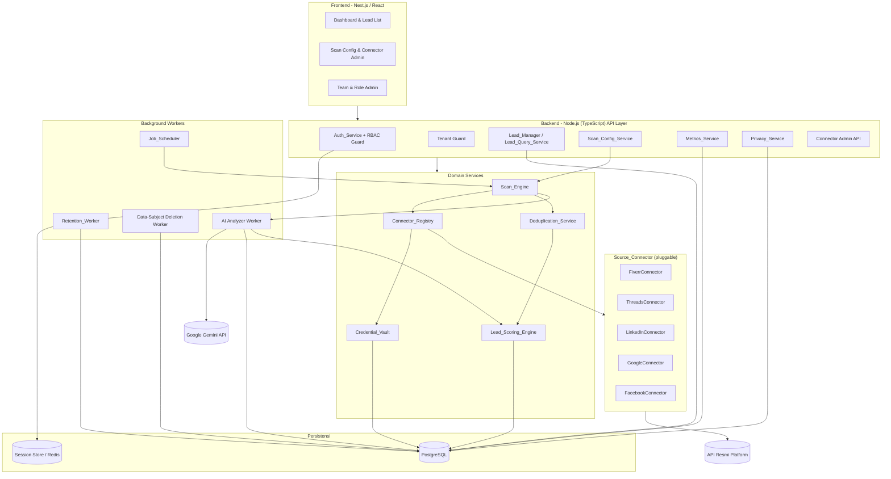
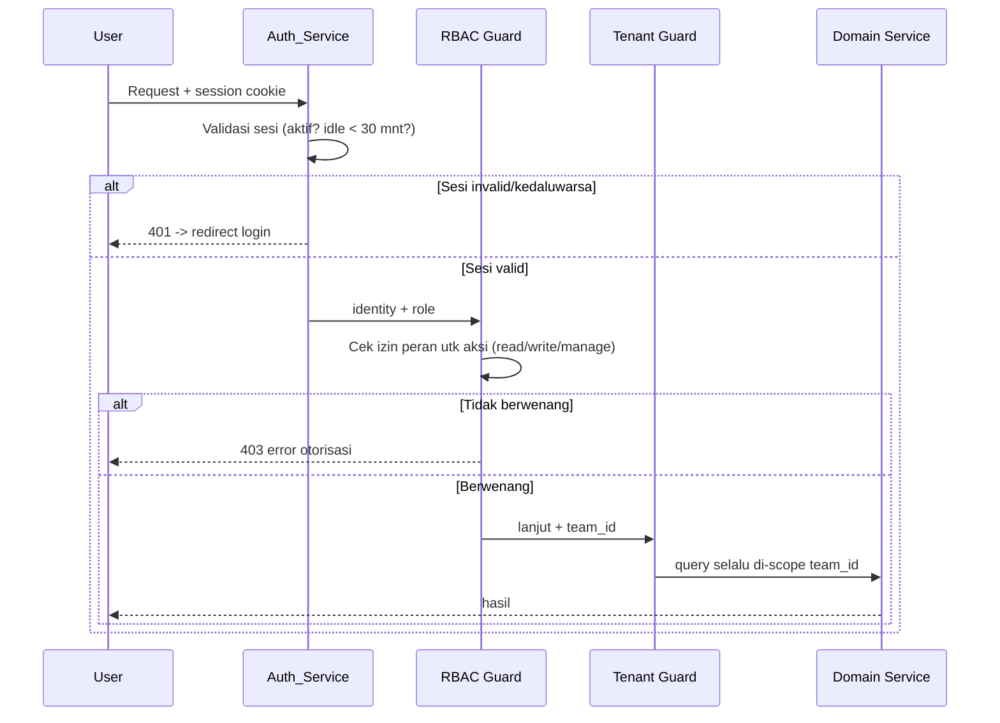
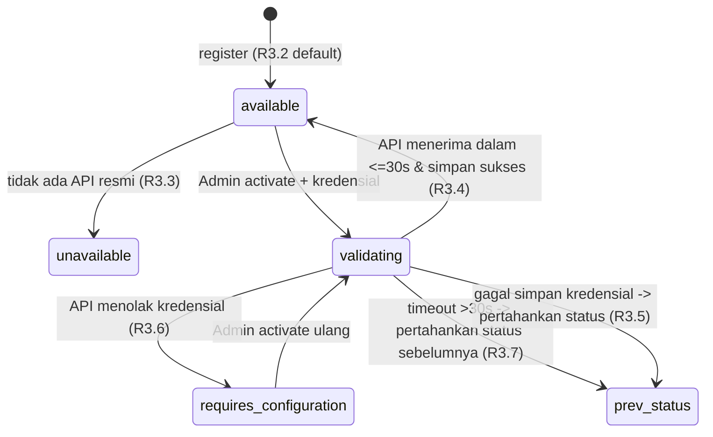
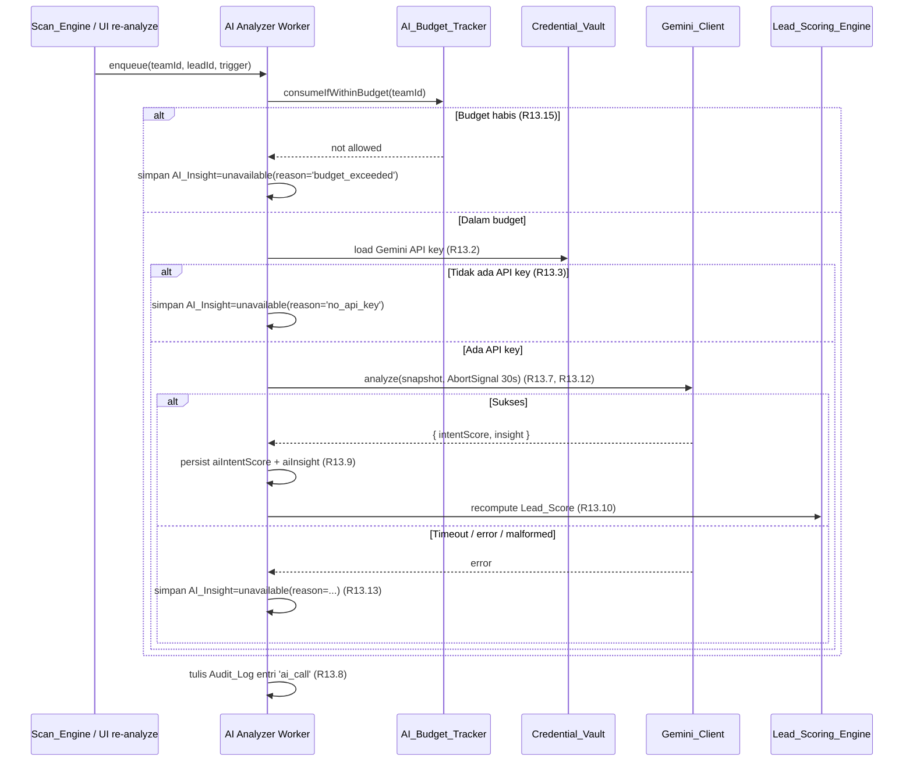
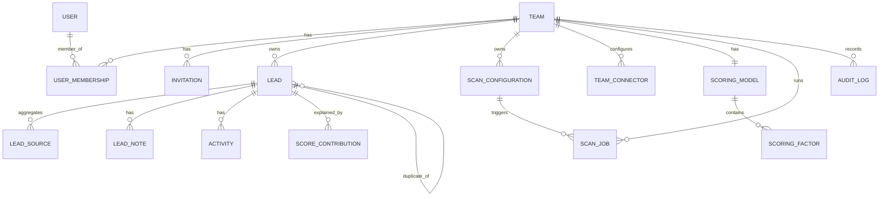
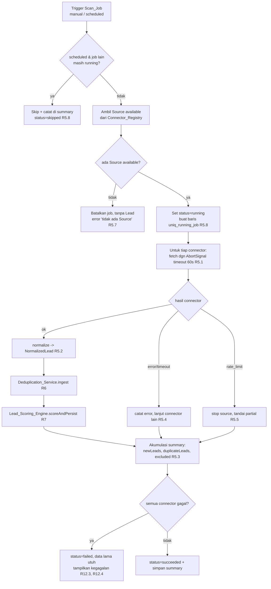
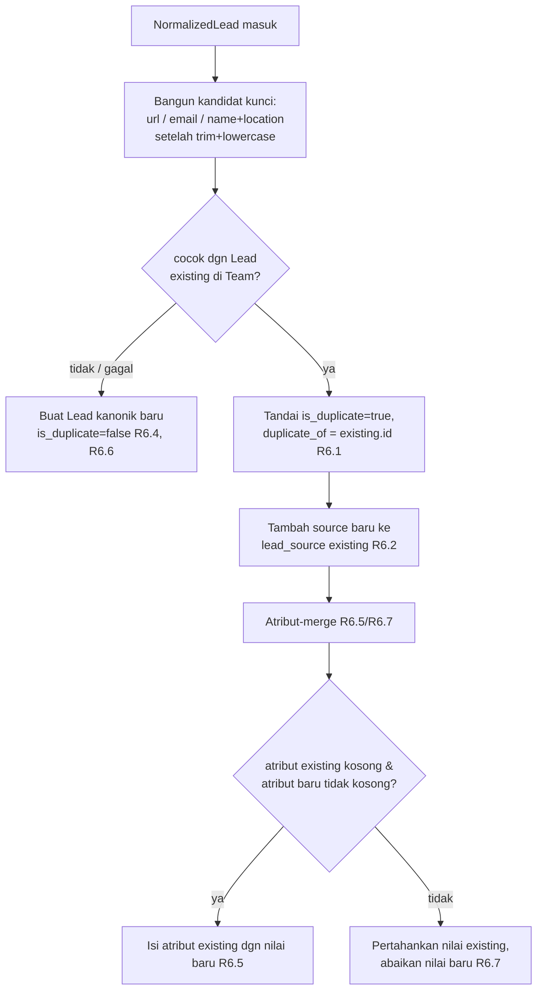
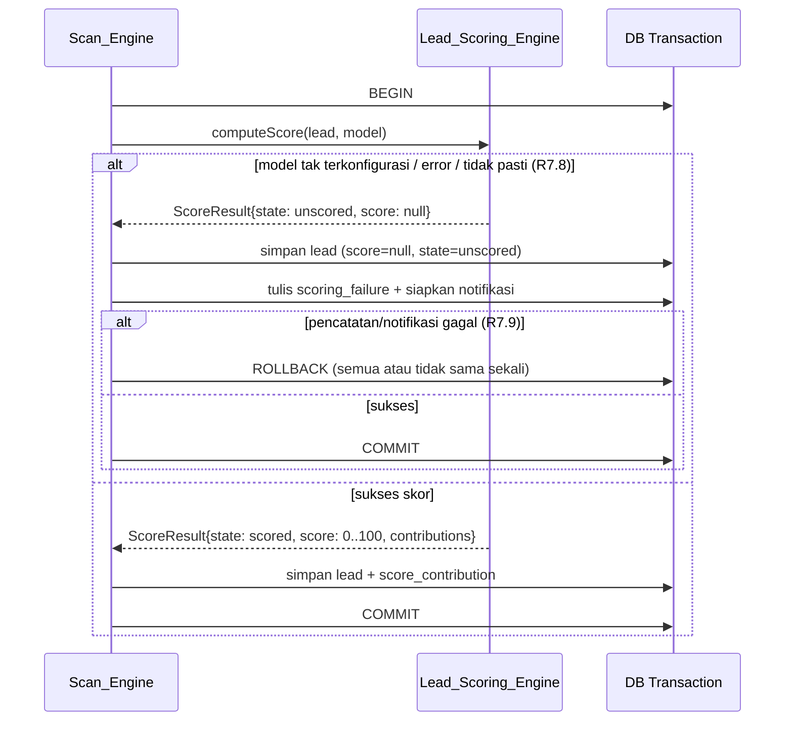
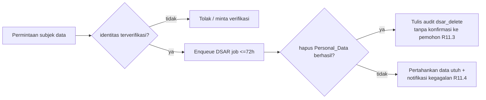

# Dokumen Desain

## Overview

Leads Generation Dashboard adalah aplikasi web SaaS multi-tim yang memindai sumber eksternal melalui API resmi, menormalkan hasil menjadi entitas Lead, menggabungkan duplikat, memberi skor potensi secara otomatis, lalu menyajikannya dalam dashboard yang dapat disaring dan ditindaklanjuti. Dokumen ini menerjemahkan 12 requirement fungsional/non-fungsional menjadi arsitektur teknis konkret di atas stack target: **frontend React/Next.js**, **backend Node.js (TypeScript)**, dan **basis data PostgreSQL**.

Penekanan utama desain ada pada **Lead_Scoring_Engine** yang bersifat deterministik, dapat dikonfigurasi per Team, transaksional, dan dapat ditelusuri (auditable). Penekanan kedua adalah **arsitektur Source_Connector yang pluggable** yang hanya menggunakan API resmi platform dan menangani sumber tanpa API secara baik.

### Prinsip Desain Utama

| Prinsip | Penjelasan | Requirement terkait |
|---|---|---|
| Isolasi data per Team | Setiap baris data ber-tenant melalui `team_id`; seluruh query difilter pada lapisan repository. | R2.8 |
| Hanya API resmi | Tidak ada scraping. Connector yang tak punya API berstatus `unavailable`. | R3, R11.9 |
| Determinisme skoring | Skor adalah fungsi murni dari atribut Lead + Scoring_Model. | R7.7 |
| Isolasi kegagalan | Kegagalan satu connector/lead tidak menggagalkan keseluruhan job/recompute. | R5.4, R7.10, R12.3 |
| Transaksionalitas | Operasi yang harus "semua atau tidak sama sekali" dibungkus transaksi DB. | R7.9 |
| Privacy by design | Hanya menyimpan data publik; retensi & penghapusan subjek data otomatis dan teraudit. | R11 |

### Pemetaan Requirement ke Komponen

| Requirement | Komponen utama |
|---|---|
| R1 Autentikasi & sesi | Auth_Service, Session Store |
| R2 Tim & peran | Auth_Service (RBAC), Team_Service, Tenant Guard |
| R3 Registrasi connector | Connector_Registry, Credential_Vault |
| R4 Konfigurasi pencarian | Scan_Config_Service (validasi) |
| R5 Eksekusi pemindaian | Scan_Engine, Job_Scheduler, Source_Connector |
| R6 Deduplikasi | Deduplication_Service |
| R7 Skoring otomatis | Lead_Scoring_Engine, Scoring_Model_Service |
| R8 Manajemen Lead | Lead_Manager, Activity_Log |
| R9 Pencarian & filter | Lead_Query_Service |
| R10 Dashboard metrik | Metrics_Service |
| R11 Privasi & PDP | Privacy_Service, Audit_Log, Retention_Worker |
| R12 Performa & keandalan | Indexing strategy, query design, status job |
| R13 Analisis niat berbasis AI | AI_Analyzer_Service, Gemini_Client, AI_Budget_Tracker |

## Architecture

### Arsitektur Tingkat Tinggi



### Alur Permintaan Berbasis Peran

Seluruh permintaan terotorisasi melewati dua lapisan penjaga sebelum mencapai domain:



Catatan R2.3: perubahan peran diterapkan pada permintaan terotorisasi **berikutnya** karena RBAC Guard membaca peran efektif dari sumber kebenaran (DB/cache yang di-invalidasi) pada setiap permintaan, bukan dari klaim sesi yang dibekukan saat login.

### Pilihan Teknologi & Alasan

- **Next.js (App Router) + React**: SSR untuk halaman daftar Lead pertama membantu target performa p95 < 2s (R12.1); komponen interaktif untuk filter.
- **Node.js + TypeScript**: tipe statis mengurangi kelas bug pada normalisasi Lead dan skoring; berbagi tipe domain antara frontend/backend.
- **PostgreSQL**: relasional cocok untuk isolasi tenant, indeks komposit untuk sort+filter, transaksi ACID untuk requirement transaksional skoring (R7.9), dan `pg_trgm` untuk pencarian substring case-insensitive (R9.2).
- **Redis (atau tabel sesi)** sebagai session store untuk idle timeout & penguncian akun (R1.5, R1.6).
- **Antrian kerja (BullMQ di atas Redis atau pg-boss di atas PostgreSQL)** untuk Scan_Job, recompute skoring, retensi, dan penghapusan subjek data agar tidak memblokir request.
- **fast-check** sebagai pustaka property-based testing (terintegrasi dengan Jest/Vitest). Referensi: [fast-check](https://github.com/dubzzz/fast-check), [@fast-check/jest](https://www.npmjs.com/package/@fast-check/jest). *Konten dirangkum ulang untuk kepatuhan lisensi.*

### Landskap Ketersediaan API (informatif, menggerakkan R3)

Tidak semua platform menyediakan API resmi yang dapat dipakai untuk penemuan prospek pihak ketiga. Misalnya akses data LinkedIn sangat dibatasi, Fiverr tidak menyediakan API publik untuk pencarian prospek umum, sedangkan Threads/Google/Facebook menyediakan API resmi dengan cakupan dan syarat tertentu. Karena lanskap ini berubah-ubah, ketersediaan **tidak di-hardcode**: setiap connector melaporkan status `available | unavailable | requires_configuration` ke Connector_Registry, dan Scan_Engine hanya mengeksekusi connector `available`. *Informasi lanskap di atas bersifat umum dan dirangkum ulang untuk kepatuhan.*

## Components and Interfaces

Antarmuka ditulis sebagai signatur TypeScript untuk menyampaikan kontrak. Semua tipe `Result<T>` di bawah merepresentasikan hasil eksplisit sukses/gagal (mis. `{ ok: true; value: T } | { ok: false; error: AppError }`) agar penanganan kesalahan eksplisit.

### Auth_Service (R1)

```typescript
interface Credentials { email: string; password: string; }

interface AuthSession {
  userId: string;
  teamId: string;
  role: Role;            // 'admin' | 'member' | 'viewer'
  createdAt: Date;
  lastActivityAt: Date;  // dipakai utk idle timeout 30 menit (R1.5)
}

interface Auth_Service {
  // R1.1 / R1.2 / R1.6: reset counter saat sukses, pesan generik saat gagal, kunci akun
  login(c: Credentials): Promise<Result<AuthSession>>;
  logout(sessionId: string): Promise<void>;                  // R1.4
  validateSession(sessionId: string): Promise<Result<AuthSession>>; // R1.3 / R1.5
  // helper internal
  recordFailedAttempt(email: string): Promise<LockState>;     // R1.6
}

interface LockState { locked: boolean; lockedUntil?: Date; failedCount: number; }
```

Aturan kunci akun (R1.6): jendela geser 15 menit; bila ≥ 5 kegagalan berturut-turut maka `lockedUntil = now + 15m`; selama terkunci semua login ditolak dengan pesan "akun terkunci sementara". Login sukses (R1.1) menyetel `failedCount = 0`. Pesan kegagalan kredensial (R1.2) tidak membedakan email vs password.

### Auth/RBAC Guard & Tenant Guard (R2)

```typescript
type Role = 'admin' | 'member' | 'viewer';
type Action =
  | 'lead.read' | 'lead.write' | 'lead.delete' | 'lead.status.change'
  | 'note.write' | 'tag.write'
  | 'scan.execute' | 'team.manage' | 'connector.manage' | 'export.run'
  | 'ai.configure' | 'ai.enable_scan' | 'ai.reanalyze' | 'ai.read_insight';

interface RBAC_Guard {
  can(role: Role, action: Action): boolean;   // matriks izin statis (R2.4-2.7)
}

// Tenant Guard: setiap query repository WAJIB menerima teamId; tidak ada akses lintas-team (R2.8)
interface TenantScoped<T> { findForTeam(teamId: string, ...args: unknown[]): Promise<T>; }
```

Matriks izin (sumber kebenaran untuk R2.4–R2.7):

| Action | Admin | Member | Viewer |
|---|---|---|---|
| lead.read | ✓ | ✓ | ✓ |
| lead.write / status.change / note.write / tag.write | ✓ | ✓ | ✗ |
| lead.delete | ✓ | ✓ | ✗ |
| scan.execute | ✓ | ✓ | ✗ |
| export.run | ✓ | ✗ | ✗ |
| team.manage / connector.manage | ✓ | ✗ | ✗ |
| ai.configure (kunci API, budget, enable global) | ✓ | ✗ | ✗ |
| ai.enable_scan (toggle AI di Scan_Configuration) | ✓ | ✓ | ✗ |
| ai.reanalyze (re-trigger AI per Lead) | ✓ | ✓ | ✗ |
| ai.read_insight (baca AI_Insight) | ✓ | ✓ | ✓ |

Catatan: Viewer dengan keanggotaan `pending` tetap memiliki `lead.read` (R2.5). Akses baca tidak bergantung pada status keanggotaan untuk peran Viewer.

### Team_Service (R2 undangan)

```typescript
interface Invitation {
  id: string; teamId: string; email: string; role: Role;
  status: 'pending' | 'active' | 'expired';
  createdAt: Date; expiresAt: Date;   // createdAt + 168 jam (R2.1)
}

interface Team_Service {
  invite(teamId: string, email: string, role: Role): Promise<Result<Invitation>>; // R2.1, R2.9
  acceptInvitation(token: string, registration: Registration): Promise<Result<Membership>>; // R2.2, R2.10
  changeRole(teamId: string, userId: string, role: Role): Promise<Result<void>>;  // R2.3
}
```

Validasi undangan (R2.9): email valid & ≤ 254 karакter & belum ada keanggotaan aktif/pending → kalau gagal, tolak tanpa membuat keanggotaan. Penerimaan setelah `expiresAt` (R2.10) → tolak dengan pesan kedaluwarsa.

### Connector_Registry & Credential_Vault (R3, R11.9)

```typescript
type ConnectorStatus = 'available' | 'unavailable' | 'requires_configuration';

interface ConnectorDescriptor {
  sourceId: string;            // 'fiverr' | 'threads' | 'linkedin' | ...
  displayName: string;
  status: ConnectorStatus;     // tepat satu status aktif (R3.1)
  unavailableReason?: string;  // ditampilkan ke User (R3.3)
  usagePolicy?: UsagePolicy;   // batasan ToS yang ditegakkan connector (R11.9)
}

interface Connector_Registry {
  list(teamId: string): Promise<ConnectorDescriptor[]>;        // R3.1
  register(descriptor: ConnectorDescriptor): Promise<void>;    // R3.2 (default 'available'), R3.9 (non-disruptif)
  get(teamId: string, sourceId: string): Promise<ConnectorDescriptor | null>;
  activate(teamId: string, sourceId: string, apiCredentials: unknown): Promise<Result<ConnectorDescriptor>>; // R3.4-3.7
}

interface Credential_Vault {
  store(teamId: string, sourceId: string, secret: string): Promise<Result<void>>; // enkripsi (R3.4)
  load(teamId: string, sourceId: string): Promise<Result<string>>;
}
```

Mesin status aktivasi connector (R3.4–R3.7):



### Scan_Config_Service (R4)

```typescript
interface ScanConfiguration {
  id: string; teamId: string;
  keywords: string[];        // 1..50, tiap kata 2..100 char setelah trim (R4.1, R4.7)
  niche?: string;            // <=100 char setelah trim (R4.4)
  location?: string;         // <=100 char setelah trim (R4.4)
  sourceIds: string[];       // minimal 1 source available (R4.3, R4.8)
  schedule?: ScheduleSpec;   // R5.6
}

interface SaveScanConfigResult {
  configuration?: ScanConfiguration;
  excludedSources: { sourceId: string; status: ConnectorStatus }[]; // R4.6
  validationErrors: ValidationError[]; // semua error dikumpulkan bersama (R4.7)
}

interface Scan_Config_Service {
  save(teamId: string, input: ScanConfigInput): Promise<SaveScanConfigResult>;
}
```

Pipeline validasi `save` (urutan deterministik):
1. Trim setiap keyword; buang keyword kosong.
2. Validasi: minimal 1 keyword tak-kosong (R4.2), jumlah ≤ 50, panjang tiap keyword 2..100 (R4.7) — **kumpulkan semua pesan kesalahan sekaligus**.
3. Validasi niche/location ≤ 100 char (R4.4).
4. Minimal 1 Source dipilih (R4.3).
5. Saring Source berstatus selain `available` → masukkan ke `excludedSources` dengan peringatan, simpan tanpa Source tersebut tanpa konfirmasi tambahan (R4.6).
6. Jika setelah penyaringan tidak ada Source tersisa → tolak (R4.8).

### Scan_Engine & Job_Scheduler (R5, R12.3–12.4)

```typescript
interface ScanJob {
  id: string; teamId: string; configurationId: string;
  trigger: 'manual' | 'scheduled';
  status: 'running' | 'succeeded' | 'failed' | 'skipped';
  startedAt: Date; finishedAt?: Date;
  summary: ScanSummary;
}

interface ScanSummary {
  newLeads: number;
  duplicateLeads: number;
  excludedSources: { sourceId: string; reason: string }[];   // R5.3, R3.8
  connectorResults: ConnectorRunResult[];                     // per-source outcome
}

interface ConnectorRunResult {
  sourceId: string;
  outcome: 'ok' | 'partial' | 'error' | 'timeout' | 'rate_limited';
  itemsFetched: number;
  error?: string;
}

interface Scan_Engine {
  run(teamId: string, configurationId: string, trigger: 'manual' | 'scheduled'): Promise<Result<ScanJob>>;
}

interface ScheduleSpec { intervalMinutes: number; } // 60..43200 (1 jam..30 hari) (R5.6)
interface Job_Scheduler {
  markDue(): Promise<ScanConfiguration[]>;   // R5.6
  hasRunningJob(configurationId: string): boolean; // R5.8 overlap prevention
}
```

### Source_Connector (kontrak pluggable, R5, R11.9)

```typescript
interface ScanQuery { keywords: string[]; niche?: string; location?: string; }

interface RawProspect {           // bentuk mentah spesifik source
  externalId?: string; name?: string; profileUrl?: string;
  publicContact?: string; location?: string; matchedKeyword: string;
  acquiredAt: Date;
}

interface Source_Connector {
  readonly sourceId: string;
  checkAvailability(): Promise<ConnectorStatus>;          // R3
  fetch(query: ScanQuery, signal: AbortSignal): Promise<RawProspect[]>; // dibatasi 60s (R5.1)
  normalize(raw: RawProspect): NormalizedLead;            // R5.2
  readonly usagePolicy?: UsagePolicy;                     // R11.9
}

interface UsagePolicy { allowedRetentionDays?: number; disallowFields?: (keyof NormalizedLead)[]; }
```

Menambah platform baru = mengimplementasikan `Source_Connector` dan mendaftarkannya ke `Connector_Registry` (R3.9 menjamin pendaftaran tidak mengubah connector lain). Connector tanpa API resmi mengembalikan `unavailable` dari `checkAvailability()`.

### Deduplication_Service (R6)

```typescript
interface NormalizedLead {
  teamId: string; name?: string; profileUrl?: string;
  publicContact?: string; location?: string;
  sources: string[]; matchedKeywords: string[]; discoveredAt: Date;
}

interface DedupResult {
  outcome: 'created' | 'merged';
  leadId: string;        // id Lead kanonik
}

interface Deduplication_Service {
  ingest(existing: LeadRepository, incoming: NormalizedLead): Promise<DedupResult>;
  identityKey(lead: NormalizedLead): IdentityKey; // dipakai utk pencocokan (R6.3)
}
```

### Lead_Scoring_Engine & Scoring_Model_Service (R7) — fitur utama

```typescript
interface ScoringFactor {
  id: string;
  kind: 'keyword_match' | 'source_weight' | 'location_match' | 'has_contact' | 'recency' | 'ai_intent_match' | 'custom';
  weight: number;       // bobot bilangan
  params?: Record<string, number | string>;
}

interface ScoringModel { teamId: string; version: number; factors: ScoringFactor[]; }

interface FactorContribution { factorId: string; rawValue: number; weightedValue: number; }

interface ScoreResult {
  score: number | null;                 // 0..100 integer, atau null = unscored (R7.2, R7.8)
  contributions: FactorContribution[];   // rincian disimpan (R7.6)
  state: 'scored' | 'unscored';
}

interface Lead_Scoring_Engine {
  // Fungsi MURNI & DETERMINISTIK (R7.7): tanpa I/O, tanpa waktu/acak
  computeScore(lead: ScorableLead, model: ScoringModel): ScoreResult;
  // Orkestrasi transaksional saat menyimpan Lead baru (R7.1, R7.8, R7.9)
  scoreAndPersist(tx: Transaction, lead: Lead, model: ScoringModel): Promise<Result<Lead>>;
  // Recompute massal saat model berubah (R7.3, R7.10)
  recomputeForTeam(teamId: string, model: ScoringModel): Promise<RecomputeReport>;
}

interface RecomputeReport { recomputed: number; preservedOnFailure: number; }
```

`computeScore` adalah inti determinisme: keluaran hanya bergantung pada `lead` dan `model`. Bila `Scoring_Model` Team mencantumkan faktor berjenis `ai_intent_match` dan `lead.aiIntentScore` sudah tersimpan, faktor ini ikut dihitung sebagai `rawValue = aiIntentScore / 100` dikali bobot. Karena `aiIntentScore` adalah atribut tersimpan pada Lead, `computeScore` tetap deterministik untuk masukan tersimpan yang sama (R7.7). Langkah pengayaan AI yang menghasilkan `aiIntentScore` (lihat AI_Analyzer_Service di bawah) sendiri non-deterministik dan diatur oleh R13.

### AI_Analyzer_Service (R13) — pengayaan opsional

```typescript
interface AIIntentResult {
  state: 'success' | 'unavailable';
  intentScore?: number;            // 0..100 integer (R13.9)
  insight?: string;                 // <= 500 karakter (R13.9)
  reason?:                          // hanya saat state='unavailable' (R13.13, R13.15)
    | 'no_api_key' | 'budget_exceeded' | 'timeout' | 'provider_error'
    | 'malformed_output' | 'quota_exceeded';
}

interface AI_Analyzer_Service {
  // Antrikan analisis AI utk Lead tertentu (dipanggil dari Scan_Engine bila opsi AI aktif,
  // atau dari Lead_Manager untuk re-analisis manual oleh Member). Asinkron.
  enqueue(teamId: string, leadId: string, trigger: 'scan' | 'manual'): Promise<void>; // R13.4, R13.16
  // Worker job: panggil Gemini, persist hasil, lalu trigger recompute Lead_Score
  process(teamId: string, leadId: string): Promise<AIIntentResult>;                    // R13.7-R13.13
}

interface Gemini_Client {
  // Timeout 30 detik per panggilan (R13.12); hanya Public_Lead_Snapshot yg dikirim (R13.7)
  analyze(apiKey: string, snapshot: PublicLeadSnapshot, signal: AbortSignal): Promise<AIIntentResult>;
}

interface PublicLeadSnapshot {
  name?: string; publicContact?: string; profileUrl?: string;
  location?: string; matchedKeywords: string[]; postSnippet?: string;
}

interface AI_Budget_Tracker {
  // Hitung panggilan dlm jendela bergulir 30 hari & cek terhadap AI_Call_Budget Team (R13.15)
  consumeIfWithinBudget(teamId: string): Promise<{ allowed: boolean; usedThisWindow: number; budget: number }>;
}
```

Alur `process` (per Lead, dijalankan worker latar belakang):



Properti penting:
- **Asinkron, tidak memblokir scan** (R13.4): Scan_Engine memasukkan job ke antrian dan langsung lanjut. Lead tetap tersimpan dengan Lead_Score berbasis aturan; saat AI selesai, skor di-recompute menambahkan faktor `ai_intent_match`.
- **Tanpa rollback** (R13.13): kegagalan AI tidak pernah memicu rollback Lead. Hanya `AI_Insight` yang ditandai `unavailable`.
- **Privasi** (R13.7): hanya `PublicLeadSnapshot` yang dikirim ke Gemini; tidak ada data lain.
- **Audit** (R13.8): setiap panggilan AI (termasuk yang gagal) dicatat di Audit_Log.

### Lead_Manager & Activity_Log (R8)

```typescript
type LeadStatus = 'New' | 'Reviewed' | 'Contacted' | 'Qualified' | 'Converted' | 'Rejected';

interface Lead_Manager {
  changeStatus(actor: AuthSession, leadId: string, to: LeadStatus): Promise<Result<Lead>>; // R8.2
  addNote(actor: AuthSession, leadId: string, body: string): Promise<Result<Note>>;         // R8.3, R8.4 (1..2000)
  deleteLead(actor: AuthSession, leadId: string, confirmed: boolean): Promise<Result<void>>; // R8.5-8.7
}

interface Activity {
  id: string; leadId: string; type: 'status_change' | 'note_added' | 'deleted';
  actorId: string; at: Date; fromStatus?: LeadStatus; toStatus?: LeadStatus;
}
```

### Lead_Query_Service (R9) & Metrics_Service (R10)

```typescript
interface LeadFilter {
  search?: string;             // 1..100 char, substring case-insensitive (R9.2)
  statuses?: LeadStatus[];     // R9.3
  sources?: string[];          // R9.4
  scoreMin?: number; scoreMax?: number; // 0..100, min<=max (R9.5, R9.8)
}

interface Page<T> { items: T[]; page: number; pageSize: 25; total: number; }

interface Lead_Query_Service {
  list(teamId: string, filter: LeadFilter, page: number): Promise<Result<Page<Lead>>>; // R9.1-9.8, sort default (R7.4-7.5)
}

interface DashboardMetrics {
  totalLeads: number;                       // exclude duplikat (R10.1)
  byStatus: Record<LeadStatus, number>;     // semua 6 status, 0 jika kosong (R10.2)
  bySource: { sourceId: string; count: number }[]; // R10.3
  conversionRatePercent: number;            // 2 desimal (R10.4, R10.5)
}

interface Metrics_Service {
  compute(teamId: string, range?: { from: Date; to: Date }): Promise<Result<DashboardMetrics>>; // R10.6, R10.7
}
```

### Privacy_Service, Audit_Log, Retention_Worker, DSAR Worker (R11)

```typescript
interface Audit_Log {
  record(entry: {
    teamId: string; actorId: string | 'system';
    action: 'create' | 'update' | 'delete' | 'export' | 'retention_delete' | 'dsar_delete' | 'ai_call';
    objectType: string; objectId: string; at: Date;
  }): Promise<void>;
}

interface Privacy_Service {
  requestDataSubjectDeletion(leadId: string, verified: boolean): Promise<Result<void>>; // R11.3, R11.4 (silent, <=72h)
  exportLeads(actor: AuthSession, filter: LeadFilter): Promise<Result<ExportArtifact>>;  // R11.5, R11.6
}

interface Retention_Worker { sweep(): Promise<void>; } // R11.7 hapus <=24 jam setelah retensi terlampaui
```

## Data Models

### Diagram Relasi Entitas



### Skema PostgreSQL

Konvensi: semua tabel data ber-tenant memiliki `team_id uuid NOT NULL` dan setiap query difilter olehnya (R2.8). Atribut Personal_Data dibatasi hanya pada data publik (R11.1).

```sql
-- ====== Identitas & Tim ======
CREATE TABLE team (
  id uuid PRIMARY KEY DEFAULT gen_random_uuid(),
  name text NOT NULL,
  data_retention_days integer NOT NULL DEFAULT 365, -- R11.7
  created_at timestamptz NOT NULL DEFAULT now()
);

CREATE TABLE app_user (
  id uuid PRIMARY KEY DEFAULT gen_random_uuid(),
  email citext UNIQUE NOT NULL,            -- citext = case-insensitive
  password_hash text NOT NULL,             -- argon2/bcrypt
  failed_login_count integer NOT NULL DEFAULT 0, -- R1.6
  locked_until timestamptz,                -- R1.6
  created_at timestamptz NOT NULL DEFAULT now()
);

CREATE TABLE user_membership (
  team_id uuid NOT NULL REFERENCES team(id),
  user_id uuid NOT NULL REFERENCES app_user(id),
  role text NOT NULL CHECK (role IN ('admin','member','viewer')), -- R2.4-2.7
  status text NOT NULL CHECK (status IN ('pending','active')),     -- R2.2, R2.5
  PRIMARY KEY (team_id, user_id)
);

CREATE TABLE invitation (
  id uuid PRIMARY KEY DEFAULT gen_random_uuid(),
  team_id uuid NOT NULL REFERENCES team(id),
  email citext NOT NULL CHECK (length(email) <= 254),  -- R2.1, R2.9
  role text NOT NULL CHECK (role IN ('admin','member','viewer')),
  status text NOT NULL CHECK (status IN ('pending','active','expired')),
  token text UNIQUE NOT NULL,
  created_at timestamptz NOT NULL DEFAULT now(),
  expires_at timestamptz NOT NULL,          -- created_at + interval '168 hours' (R2.1)
  -- cegah duplikat undangan aktif/pending utk email yg sama di satu team (R2.9)
  CONSTRAINT uniq_pending_invite UNIQUE (team_id, email, status)
);

-- ====== Connector & Kredensial ======
CREATE TABLE team_connector (
  team_id uuid NOT NULL REFERENCES team(id),
  source_id text NOT NULL,
  status text NOT NULL CHECK (status IN ('available','unavailable','requires_configuration')), -- R3.1
  unavailable_reason text,                  -- R3.3
  encrypted_credentials bytea,              -- R3.4 (enkripsi at-rest)
  usage_policy jsonb,                       -- R11.9
  updated_at timestamptz NOT NULL DEFAULT now(),
  PRIMARY KEY (team_id, source_id)
);

-- ====== Scan ======
CREATE TABLE scan_configuration (
  id uuid PRIMARY KEY DEFAULT gen_random_uuid(),
  team_id uuid NOT NULL REFERENCES team(id),
  keywords text[] NOT NULL CHECK (array_length(keywords,1) BETWEEN 1 AND 50), -- R4.1, R4.7
  niche text CHECK (niche IS NULL OR length(niche) <= 100),     -- R4.4
  location text CHECK (location IS NULL OR length(location) <= 100),
  source_ids text[] NOT NULL CHECK (array_length(source_ids,1) >= 1),
  schedule_interval_minutes integer CHECK (schedule_interval_minutes BETWEEN 60 AND 43200), -- R5.6
  ai_enabled boolean NOT NULL DEFAULT false,    -- R13.4 (opt-in per Scan_Configuration)
  created_at timestamptz NOT NULL DEFAULT now()
);

CREATE TABLE scan_job (
  id uuid PRIMARY KEY DEFAULT gen_random_uuid(),
  team_id uuid NOT NULL REFERENCES team(id),
  configuration_id uuid NOT NULL REFERENCES scan_configuration(id),
  trigger text NOT NULL CHECK (trigger IN ('manual','scheduled')),
  status text NOT NULL CHECK (status IN ('running','succeeded','failed','skipped')), -- R5.8, R12.4
  summary jsonb NOT NULL DEFAULT '{}',      -- ScanSummary (R5.3)
  started_at timestamptz NOT NULL DEFAULT now(),
  finished_at timestamptz
);
-- overlap prevention (R5.8): cegah dua job 'running' utk configuration yg sama
CREATE UNIQUE INDEX uniq_running_job ON scan_job (configuration_id)
  WHERE status = 'running';

-- ====== Lead ======
CREATE TABLE lead (
  id uuid PRIMARY KEY DEFAULT gen_random_uuid(),
  team_id uuid NOT NULL REFERENCES team(id),
  name text,                 -- Personal_Data publik (R11.1)
  public_contact text,
  profile_url text,
  location text,
  matched_keywords text[] NOT NULL DEFAULT '{}',
  status text NOT NULL DEFAULT 'New'
    CHECK (status IN ('New','Reviewed','Contacted','Qualified','Converted','Rejected')), -- R8.1
  score smallint CHECK (score IS NULL OR score BETWEEN 0 AND 100), -- R7.2; NULL = unscored (R7.8)
  score_state text NOT NULL DEFAULT 'unscored' CHECK (score_state IN ('scored','unscored')),
  is_duplicate boolean NOT NULL DEFAULT false,   -- R6.1, R10.1
  duplicate_of uuid REFERENCES lead(id),         -- R6.1
  discovered_at timestamptz NOT NULL DEFAULT now(), -- R8.8, R10.6
  acquired_source text,        -- R11.2 ketertelusuran
  acquired_at timestamptz,     -- R11.2
  ai_intent_score smallint CHECK (ai_intent_score IS NULL OR ai_intent_score BETWEEN 0 AND 100), -- R13.9
  ai_insight text CHECK (ai_insight IS NULL OR length(ai_insight) <= 500),                         -- R13.9
  ai_state text NOT NULL DEFAULT 'none'                                                            -- R13.13, R13.15
    CHECK (ai_state IN ('none','pending','success','unavailable')),
  ai_unavailable_reason text,  -- mis. 'no_api_key', 'budget_exceeded', 'timeout', 'provider_error', 'malformed_output'
  ai_analyzed_at timestamptz,
  created_at timestamptz NOT NULL DEFAULT now()
);

CREATE TABLE lead_source (   -- daftar Source per Lead kanonik (R6.2)
  lead_id uuid NOT NULL REFERENCES lead(id) ON DELETE CASCADE,
  source_id text NOT NULL,
  acquired_at timestamptz NOT NULL DEFAULT now(),
  PRIMARY KEY (lead_id, source_id)
);

CREATE TABLE lead_note (   -- R8.3, R8.4
  id uuid PRIMARY KEY DEFAULT gen_random_uuid(),
  lead_id uuid NOT NULL REFERENCES lead(id) ON DELETE CASCADE,
  body text NOT NULL CHECK (length(body) BETWEEN 1 AND 2000),
  author_id uuid NOT NULL REFERENCES app_user(id),
  created_at timestamptz NOT NULL DEFAULT now()
);

CREATE TABLE activity (    -- R8.2
  id uuid PRIMARY KEY DEFAULT gen_random_uuid(),
  lead_id uuid NOT NULL REFERENCES lead(id) ON DELETE CASCADE,
  type text NOT NULL CHECK (type IN ('status_change','note_added','deleted')),
  actor_id uuid,
  from_status text, to_status text,
  at timestamptz NOT NULL DEFAULT now()
);

-- ====== Scoring ======
CREATE TABLE scoring_model (
  team_id uuid PRIMARY KEY REFERENCES team(id),
  version integer NOT NULL DEFAULT 1,   -- R7.3 (naik saat berubah)
  factors jsonb NOT NULL DEFAULT '[]'
);

CREATE TABLE score_contribution (   -- R7.6 rincian faktor disimpan
  lead_id uuid NOT NULL REFERENCES lead(id) ON DELETE CASCADE,
  model_version integer NOT NULL,
  factor_id text NOT NULL,
  raw_value numeric NOT NULL,
  weighted_value numeric NOT NULL,
  PRIMARY KEY (lead_id, factor_id)
);

CREATE TABLE scoring_failure (   -- R7.8 pencatatan kegagalan/ketidakpastian
  id uuid PRIMARY KEY DEFAULT gen_random_uuid(),
  lead_id uuid NOT NULL REFERENCES lead(id) ON DELETE CASCADE,
  reason text NOT NULL CHECK (reason IN ('compute_error','model_unconfigured','uncertain')),
  at timestamptz NOT NULL DEFAULT now()
);

-- ====== Audit ======
CREATE TABLE audit_log (   -- R11.2, R11.5, R11.8, R13.8
  id uuid PRIMARY KEY DEFAULT gen_random_uuid(),
  team_id uuid NOT NULL REFERENCES team(id),
  actor_id text NOT NULL,    -- uuid user atau 'system'
  action text NOT NULL CHECK (action IN
    ('create','update','delete','export','retention_delete','dsar_delete','ai_call')),
  object_type text NOT NULL,
  object_id text NOT NULL,
  metadata jsonb,            -- mis. ai_call: { trigger, outcome, reason }
  at timestamptz NOT NULL DEFAULT now()
);

-- ====== Pengayaan AI (R13) ======
CREATE TABLE team_ai_settings (
  team_id uuid PRIMARY KEY REFERENCES team(id),
  encrypted_gemini_api_key bytea,                  -- R13.2 (enkripsi at-rest, BYO per Team)
  ai_enabled boolean NOT NULL DEFAULT false,       -- R13.18 (Admin enable global)
  call_budget_30d integer NOT NULL DEFAULT 0       -- R13.15, R13.18 (AI_Call_Budget)
    CHECK (call_budget_30d >= 0),
  ai_intent_factor_weight numeric NOT NULL DEFAULT 1.0  -- R13.10 (bobot factor 'ai_intent_match')
    CHECK (ai_intent_factor_weight >= 0),
  updated_at timestamptz NOT NULL DEFAULT now()
);

CREATE TABLE ai_call_log (   -- penghitung jendela bergulir 30 hari (R13.15)
  id uuid PRIMARY KEY DEFAULT gen_random_uuid(),
  team_id uuid NOT NULL REFERENCES team(id),
  lead_id uuid NOT NULL REFERENCES lead(id) ON DELETE CASCADE,
  trigger text NOT NULL CHECK (trigger IN ('scan','manual')),
  outcome text NOT NULL CHECK (outcome IN
    ('success','timeout','provider_error','malformed_output','no_api_key','budget_exceeded','quota_exceeded')),
  at timestamptz NOT NULL DEFAULT now()
);
CREATE INDEX idx_ai_call_log_window ON ai_call_log (team_id, at);
```

### Strategi Indeks (mendukung R9 & R12)

```sql
-- Sort bawaan: score desc, discovered_at desc, id asc (R7.4, R7.5) untuk Lead non-duplikat
CREATE INDEX idx_lead_default_sort ON lead (team_id, score DESC, discovered_at DESC, id ASC)
  WHERE is_duplicate = false;

-- Filter status & source (R9.3, R9.4)
CREATE INDEX idx_lead_status ON lead (team_id, status) WHERE is_duplicate = false;
CREATE INDEX idx_lead_source ON lead_source (source_id);

-- Pencarian substring case-insensitive (R9.2) memakai trigram
CREATE EXTENSION IF NOT EXISTS pg_trgm;
CREATE INDEX idx_lead_search_trgm ON lead USING gin (
  (coalesce(name,'') || ' ' || coalesce(public_contact,'') || ' ' || coalesce(location,'')) gin_trgm_ops
);

-- Sweep retensi (R11.7)
CREATE INDEX idx_lead_acquired_at ON lead (team_id, acquired_at);
```

Indeks komposit `idx_lead_default_sort` memungkinkan halaman pertama daftar Lead diambil dengan keyset/limit tanpa full scan, kunci pemenuhan target p95 < 2s pada 100k Lead (R12.1). Index trigram GIN mendukung pencarian substring < 1s pada 10k Lead (R12.2).

### Aturan Konsistensi Penting

- **Eksklusi duplikat dari metrik & daftar utama** (R6.1, R10.1, R10.3): semua query daftar/metrik memfilter `is_duplicate = false`.
- **Identitas duplikat** dihitung di aplikasi (bukan constraint DB) karena melibatkan normalisasi case-insensitive + trim + tiga aturan pencocokan (R6.3).
- **Transaksi skoring** (R7.9): penyimpanan Lead + `score_contribution`/`scoring_failure` + notifikasi dibungkus dalam satu transaksi; bila langkah penanganan kegagalan gagal, transaksi di-`ROLLBACK`.

## Alur Eksekusi Pemindaian (Scan Execution Flow)

Scan_Engine mengeksekusi connector secara terisolasi: kegagalan/timeout/rate-limit satu connector tidak menggagalkan yang lain (R5.4, R5.5), dan kegagalan total mempertahankan data lama (R12.3).



Catatan R12.4: status `scan_job` ditulis berdasarkan hasil eksekusi sebenarnya **sebelum** dan terlepas dari pengiriman notifikasi, sehingga status selalu mencerminkan kenyataan walau notifikasi gagal.

## Algoritma Deduplikasi (Deduplication Algorithm)

Tujuan: mendeteksi prospek yang sama lintas-source dan menggabungkannya ke satu Lead kanonik (R6).

### Normalisasi & Kunci Identitas (R6.3)

Setiap nilai dinormalkan dengan: `trim()` lalu `toLowerCase()`. Tiga aturan kecocokan (dievaluasi berurutan, OR):
1. `profile_url` ternormalisasi identik, ATAU
2. `public_contact` (email) ternormalisasi identik, ATAU
3. kombinasi `name` + `location` ternormalisasi identik.

Nilai kosong (atau hanya spasi) **tidak** dipakai sebagai kunci pencocokan (mencegah penggabungan palsu antar-Lead yang sama-sama kosong).



### Aturan Merge Atribut

| Kondisi existing | Kondisi incoming | Aksi | Requirement |
|---|---|---|---|
| kosong | tidak kosong | isi dari incoming | R6.5 |
| tidak kosong | tidak kosong & berbeda | pertahankan existing | R6.7 |
| tidak kosong | sama | tidak ada perubahan | R6.7 |
| (tidak cocok) | — | Lead terpisah | R6.4, R6.6 |

Sifat penting: operasi `ingest` **idempoten** terhadap Lead yang sudah ada — meng-ingest ulang Lead identik tidak mengubah daftar utama maupun atribut kanonik (mendasari properti pengujian).

## Desain Scoring_Model (fitur utama, R7)

### Model Faktor Berbobot

`Lead_Score` dihitung sebagai fungsi murni dari atribut Lead dan `ScoringModel` Team. Setiap faktor menghasilkan `rawValue` ∈ [0,1], dikalikan `weight`, lalu dijumlahkan dan dinormalkan ke bilangan bulat 0–100.

```
weightedValue_i = clamp(rawValue_i, 0, 1) * weight_i
rawScore        = Σ weightedValue_i
normalized      = rawScore / Σ weight_i            (jika Σ weight_i > 0)
score           = round(normalized * 100)          (R7.2: integer 0..100)
score           = clamp(score, 0, 100)
```

Karena tidak ada pemanggilan waktu/acak/I/O di dalam `computeScore`, keluaran identik untuk masukan identik (R7.7 — determinisme). Pembulatan memakai aturan tetap (round half up) agar deterministik.

Contoh `kind` faktor bawaan:

| kind | rawValue | Catatan |
|---|---|---|
| keyword_match | proporsi keyword pemicu yang cocok | 0..1 |
| source_weight | bobot relatif source | dipetakan ke 0..1 |
| location_match | 1 jika lokasi cocok target, else 0 | boolean |
| has_contact | 1 jika ada kontak publik, else 0 | boolean |
| recency | fungsi menurun dari umur penemuan | 0..1, memakai `discoveredAt` yang tersimpan (bukan now()) agar tetap deterministik |

### Penanganan unscored & Transaksionalitas



### Recompute saat Model Berubah (R7.3, R7.10)

Saat `ScoringModel` di-`update`, `version` dinaikkan dan `recomputeForTeam` menghitung ulang seluruh Lead Team. Per-Lead diisolasi: bila satu Lead gagal di-recompute, skor sebelumnya dipertahankan dan proses lanjut ke Lead berikutnya (R7.10). Recompute dijalankan sebagai background job agar tidak memblokir.

## Correctness Properties

*Sebuah properti adalah karakteristik atau perilaku yang harus selalu benar di seluruh eksekusi sistem yang valid — pada dasarnya pernyataan formal tentang apa yang harus dilakukan sistem. Properti menjembatani spesifikasi yang terbaca manusia dengan jaminan kebenaran yang dapat diverifikasi mesin.*

Properti berikut diturunkan dari prework analisis kriteria penerimaan dan telah dikonsolidasikan untuk menghilangkan redundansi. Setiap properti bersifat terkuantifikasi universal dan akan diuji dengan property-based testing (fast-check).

### Property 1: Determinisme skoring

*Untuk setiap* Lead dan Scoring_Model, memanggil `computeScore` berkali-kali (termasuk pada salinan masukan yang setara) SHALL selalu menghasilkan `ScoreResult` yang identik.

**Validates: Requirements 7.7**

### Property 2: Batas rentang skor

*Untuk setiap* Lead dan Scoring_Model, hasil `computeScore` SHALL berupa `null` (unscored) ATAU bilangan bulat dalam rentang 0 sampai 100 inklusif.

**Validates: Requirements 7.2**

### Property 3: Persist & recompute konsisten dengan computeScore

*Untuk setiap* Lead dan Scoring_Model, setelah Lead disimpan atau di-recompute, nilai `score` dan `score_state` yang tersimpan SHALL sama dengan keluaran `computeScore(lead, model)`.

**Validates: Requirements 7.1, 7.3**

### Property 4: Kontribusi faktor konsisten dengan skor

*Untuk setiap* Lead yang berstatus `scored`, himpunan `FactorContribution` yang disimpan SHALL memuat tepat satu entri per faktor Scoring_Model, dan agregasi kontribusi ternormalkan SHALL menghasilkan `score` yang tersimpan.

**Validates: Requirements 7.6**

### Property 5: Penanganan keadaan unscored

*Untuk setiap* kondisi kegagalan penghitungan, model yang belum dikonfigurasi, atau hasil tidak pasti, Lead SHALL tersimpan dengan `score = null` dan `score_state = 'unscored'` serta tercatat satu entri `scoring_failure`.

**Validates: Requirements 7.8**

### Property 6: Atomisitas penyimpanan Lead unscored

*Untuk setiap* titik kegagalan yang disuntikkan pada langkah pencatatan kegagalan atau notifikasi, transaksi SHALL di-rollback sehingga Lead tidak tersimpan (semua langkah berhasil bersama-sama atau tidak sama sekali).

**Validates: Requirements 7.9**

### Property 7: Isolasi kegagalan recompute

*Untuk setiap* subset Lead yang gagal di-recompute saat Scoring_Model berubah, setiap Lead yang gagal SHALL mempertahankan `score` sebelumnya sedangkan seluruh Lead lain SHALL ter-recompute sesuai model baru.

**Validates: Requirements 7.10**

### Property 8: Pengurutan total deterministik

*Untuk setiap* kumpulan Lead, urutan bawaan SHALL non-naik berdasarkan `score`, dan untuk skor yang sama diurutkan `discovered_at` menurun lalu `id` menaik, menghasilkan urutan total yang deterministik.

**Validates: Requirements 7.4, 7.5**

### Property 9: Pencocokan identitas case-insensitive & trim

*Untuk setiap* dua nilai identitas (URL profil, email, atau nama+lokasi) yang hanya berbeda pada huruf besar/kecil dan/atau spasi awal/akhir, Deduplication_Service SHALL menganggapnya cocok.

**Validates: Requirements 6.3**

### Property 10: Lead cocok digabung tanpa entri utama baru

*Untuk setiap* Lead masuk yang identitasnya cocok dengan Lead kanonik yang sudah ada, ingest SHALL menandainya `is_duplicate`, menautkannya ke Lead kanonik, menambahkan Source-nya ke Lead kanonik, dan tidak menambah entri baru pada daftar utama.

**Validates: Requirements 6.1, 6.2**

### Property 11: Lead tak cocok menjadi entri terpisah

*Untuk setiap* Lead masuk yang identitasnya tidak cocok dengan Lead kanonik mana pun, ingest SHALL membuat entri kanonik terpisah tanpa berbagi atribut dengan Lead lain.

**Validates: Requirements 6.4, 6.6**

### Property 12: Idempotensi ingest

*Untuk setiap* Lead yang sudah menjadi kanonik, meng-ingest kembali Lead dengan identitas dan atribut yang setara SHALL tidak mengubah jumlah Lead pada daftar utama maupun atribut kanonik.

**Validates: Requirements 6.1, 6.4**

### Property 13: Aturan merge atribut (existing-wins, fill-empty)

*Untuk setiap* penggabungan Lead duplikat, setiap atribut yang kosong pada Lead kanonik dan tidak kosong pada Lead masuk SHALL diisi dari Lead masuk, sedangkan setiap atribut yang sudah tidak kosong pada Lead kanonik SHALL dipertahankan apa adanya.

**Validates: Requirements 6.5, 6.7**

### Property 14: Normalisasi Lead baru

*Untuk setiap* `RawProspect` yang dinormalkan menjadi Lead baru, Lead SHALL memiliki `status = 'New'`, `discovered_at` terisi, serta Source dan waktu perolehan (`acquired_source`, `acquired_at`) yang tercatat.

**Validates: Requirements 5.2, 8.8, 11.2**

### Property 15: Matriks izin RBAC

*Untuk setiap* pasangan (peran, aksi), `RBAC_Guard.can` SHALL mengembalikan hasil sesuai matriks izin: Viewer ditolak untuk semua aksi tulis dan diizinkan membaca (termasuk saat keanggotaan `pending`), Member ditolak mengelola tim dan ekspor namun diizinkan menulis/scan, dan Admin diizinkan untuk semua aksi.

**Validates: Requirements 2.4, 2.5, 2.6, 2.7, 11.6**

### Property 16: Isolasi data tenant

*Untuk setiap* kumpulan Team dan Lead, query yang dijalankan atas nama User suatu Team SHALL hanya mengembalikan Lead milik Team tersebut dan tidak pernah Lead milik Team lain.

**Validates: Requirements 2.8**

### Property 17: Validasi & normalisasi Scan_Configuration

*Untuk setiap* masukan Scan_Configuration, sistem SHALL memangkas spasi setiap keyword, menerima penyimpanan hanya jika terdapat 1–50 keyword tak-kosong sepanjang 2–100 karakter dan niche/lokasi ≤ 100 karakter, serta jika ada pelanggaran SHALL menolak dan mengembalikan seluruh pesan kesalahan yang berlaku secara bersamaan.

**Validates: Requirements 4.1, 4.2, 4.4, 4.7**

### Property 18: Penyaringan Source non-available pada konfigurasi

*Untuk setiap* himpunan Source pada Scan_Configuration, konfigurasi yang tersimpan SHALL hanya memuat Source berstatus `available`, daftar `excludedSources` SHALL memuat tepat Source berstatus selain `available`, dan jika tidak ada Source `available` tersisa maka penyimpanan SHALL ditolak.

**Validates: Requirements 4.6, 4.8**

### Property 19: Validasi interval penjadwalan

*Untuk setiap* nilai interval penjadwalan, sistem SHALL menerimanya jika dan hanya jika berada antara 60 menit dan 43200 menit (1 jam sampai 30 hari) inklusif.

**Validates: Requirements 5.6**

### Property 20: Seleksi connector available saat eksekusi

*Untuk setiap* himpunan Source_Connector dengan status acak, Scan_Engine SHALL mengeksekusi tepat connector berstatus `available` dan mencatat setiap connector yang dikecualikan pada hasil Scan_Job.

**Validates: Requirements 3.8**

### Property 21: Non-interferensi registrasi connector

*Untuk setiap* keadaan Connector_Registry, mendaftarkan sebuah Source_Connector baru SHALL tidak mengubah status maupun konfigurasi Source_Connector lain yang sudah terdaftar.

**Validates: Requirements 3.9**

### Property 22: Pencegahan tumpang-tindih Scan_Job terjadwal

*Untuk setiap* urutan pemicuan Scan_Job terjadwal pada satu Scan_Configuration, tidak pernah ada lebih dari satu Scan_Job berstatus `running` secara bersamaan, dan job yang jatuh tempo saat job lain berjalan SHALL ditandai `skipped` dan dicatat.

**Validates: Requirements 5.8**

### Property 23: Pencatatan Activity perubahan status

*Untuk setiap* perubahan Lead_Status ke status tujuan yang berbeda, Lead_Manager SHALL menyimpan status baru dan mencatat satu Activity berisi status asal, status tujuan, pelaku, dan waktu.

**Validates: Requirements 8.2**

### Property 24: Validasi catatan tindak lanjut

*Untuk setiap* string catatan, Lead_Manager SHALL menyimpannya beserta pembuat dan waktu jika dan hanya jika panjangnya 1–2000 karakter; di luar rentang itu penyimpanan ditolak dan catatan yang ada tidak berubah.

**Validates: Requirements 8.3, 8.4**

### Property 25: Filter merupakan irisan predikat (logika DAN)

*Untuk setiap* dataset Lead dan kombinasi kriteria (pencarian substring case-insensitive, status, source, rentang skor inklusif), himpunan hasil SHALL sama persis dengan himpunan Lead yang memenuhi seluruh predikat (irisan), dan tidak ada Lead di luar irisan tersebut.

**Validates: Requirements 9.2, 9.3, 9.4, 9.5, 9.7**

### Property 26: Validasi rentang skor filter

*Untuk setiap* rentang skor dengan batas bawah melebihi batas atas atau nilai di luar 0–100, sistem SHALL menolak penerapan filter dan tidak mengubah hasil saat ini.

**Validates: Requirements 9.8**

### Property 27: Pagination mempertahankan ukuran & urutan

*Untuk setiap* kumpulan Lead, setiap halaman SHALL memuat paling banyak 25 Lead dan konkatenasi seluruh halaman secara berurutan SHALL sama dengan daftar penuh dalam urutan bawaan tanpa duplikasi atau kehilangan.

**Validates: Requirements 9.1**

### Property 28: Konsistensi agregasi metrik

*Untuk setiap* dataset Lead, metrik dashboard SHALL mengecualikan Duplicate_Lead, `total` SHALL sama dengan jumlah Lead non-duplikat, jumlah seluruh `byStatus` (mencakup keenam status, bernilai 0 jika kosong) SHALL sama dengan `total`, dan jumlah seluruh `bySource` SHALL konsisten dengan `total`.

**Validates: Requirements 10.1, 10.2, 10.3**

### Property 29: Perhitungan tingkat konversi

*Untuk setiap* dataset Lead dengan total lebih besar dari nol, tingkat konversi SHALL sama dengan (jumlah Lead `Converted` dibagi total) dikali 100 dibulatkan ke dua angka desimal.

**Validates: Requirements 10.4**

### Property 30: Penyaringan metrik berdasarkan rentang tanggal

*Untuk setiap* rentang tanggal valid (awal ≤ akhir), metrik yang dihitung ulang SHALL sama dengan metrik yang dihitung atas subset Lead yang `discovered_at`-nya berada dalam rentang tersebut secara inklusif.

**Validates: Requirements 10.6**

### Property 31: Kelayakan penghapusan retensi

*Untuk setiap* kumpulan Lead dengan `acquired_at` acak dan Data_Retention_Period Team, sweep retensi SHALL menghapus tepat Lead yang umur penyimpanannya melampaui periode retensi dan tidak menghapus Lead lainnya.

**Validates: Requirements 11.7**

### Property 32: Penegakan kebijakan penggunaan Source

*Untuk setiap* data yang diperoleh dari Source yang memiliki `UsagePolicy`, Source_Connector SHALL tidak mempertahankan field yang dilarang kebijakan dan menerapkan batas retensi kebijakan tersebut.

**Validates: Requirements 11.9**

### Property 33: Penguncian akun berbasis ambang

*Untuk setiap* urutan percobaan login gagal dengan timestamp, akun SHALL terkunci jika dan hanya jika terdapat 5 kegagalan berturut-turut dalam jendela 15 menit, dan selama periode penguncian 15 menit setiap upaya masuk SHALL ditolak.

**Validates: Requirements 1.6**

### Property 34: Kedaluwarsa sesi idle

*Untuk setiap* durasi tidak-aktif, sesi terautentikasi SHALL dianggap kedaluwarsa jika dan hanya jika selisih waktu sejak aktivitas terakhir mencapai atau melebihi 30 menit.

**Validates: Requirements 1.5**

### Property 35: Validasi undangan

*Untuk setiap* masukan undangan, sistem SHALL membuat keanggotaan pending (berlaku 168 jam) jika dan hanya jika email valid, ≤ 254 karakter, dan belum ada keanggotaan aktif/pending untuk email itu; selain itu undangan SHALL ditolak tanpa membuat keanggotaan.

**Validates: Requirements 2.1, 2.9**

### Property 36: Keamanan kegagalan Scan_Job total

*Untuk setiap* keadaan awal Lead Team, Scan_Job yang gagal total SHALL membiarkan seluruh Lead yang sudah ada tidak berubah dan menandai Scan_Job berstatus `failed` terlepas dari berhasil atau tidaknya penyampaian notifikasi.

**Validates: Requirements 12.3, 12.4**

### Property 37: Determinisme `computeScore` dengan AI_Intent_Score tersimpan

*Untuk setiap* Lead tersimpan dengan `aiIntentScore` yang sudah ditetapkan dan Scoring_Model yang memuat faktor `ai_intent_match`, pemanggilan `computeScore` berkali-kali SHALL menghasilkan `Lead_Score` yang identik (atribut AI sebagai input tersimpan tidak melanggar determinisme komputasi).

**Validates: Requirements 7.7, 13.10**

### Property 38: Privasi panggilan AI

*Untuk setiap* Lead yang dikirim ke AI_Provider, payload yang dikirim SHALL hanya memuat field `Public_Lead_Snapshot` (nama, kontak publik, URL profil, lokasi, kata kunci pemicu, cuplikan post) dan tidak memuat atribut Lead lain di luar daftar tersebut.

**Validates: Requirements 13.7**

### Property 39: Fallback AI tidak memblokir scan dan tidak memicu rollback

*Untuk setiap* mode kegagalan AI (no_api_key, budget_exceeded, timeout, provider_error, malformed_output, quota_exceeded), Lead SHALL tetap tersimpan dengan Lead_Score berbasis aturan tanpa faktor `ai_intent_match`, AI_Insight Lead SHALL ditandai `unavailable` dengan reason yang sesuai, dan eksekusi Scan_Job SHALL berlanjut tanpa rollback Lead.

**Validates: Requirements 13.13, 13.14**

### Property 40: AI_Call_Budget berbasis jendela bergulir 30 hari

*Untuk setiap* urutan panggilan AI dengan timestamp, AI_Analyzer_Service SHALL mengizinkan panggilan jika dan hanya jika jumlah panggilan dalam jendela 30 hari terakhir hingga saat ini kurang dari `AI_Call_Budget` Team; saat tercapai, panggilan berikutnya SHALL dijeda dengan reason `budget_exceeded` sampai jumlah dalam jendela kembali turun di bawah budget.

**Validates: Requirements 13.15**

### Property 41: Audit log panggilan AI lengkap

*Untuk setiap* panggilan AI yang diinisiasi (sukses maupun gagal), Audit_Log SHALL memuat tepat satu entri ber-action `ai_call` yang mencatat pelaku, Lead, trigger (`scan` atau `manual`), waktu, dan outcome.

**Validates: Requirements 13.8**

### Property 42: Otorisasi peran untuk fitur AI

*Untuk setiap* pasangan (peran, aksi AI), RBAC_Guard SHALL mengizinkan: hanya Admin untuk `ai.configure`; Admin dan Member untuk `ai.enable_scan` dan `ai.reanalyze`; semua peran (termasuk Viewer) untuk `ai.read_insight`.

**Validates: Requirements 13.11, 13.16, 13.17, 13.18**

### Property 43: Timeout panggilan AI

*Untuk setiap* panggilan AI yang melampaui 30 detik, AI_Analyzer_Service SHALL membatalkan panggilan via AbortSignal, menandai outcome sebagai `timeout`, dan menerapkan jalur fallback (Property 39).

**Validates: Requirements 13.12, 13.13**

### Property 44: Pra-syarat enable AI per Scan_Configuration

*Untuk setiap* Scan_Configuration, opsi `ai_enabled = true` SHALL hanya dapat disimpan jika Team memiliki kunci API Gemini terkonfigurasi; jika tidak, opsi pengaktifan SHALL dinonaktifkan.

**Validates: Requirements 13.3, 13.4**

## Error Handling

Strategi penanganan kesalahan dibagi berdasarkan domain dan tingkat keparahan, dengan prinsip: kegagalan terisolasi, status selalu mencerminkan kenyataan, dan operasi sensitif bersifat transaksional.

### Klasifikasi & Strategi

| Domain | Jenis kegagalan | Strategi | Requirement |
|---|---|---|---|
| Auth | Kredensial salah | Pesan generik (tidak ungkap email/password); tambah counter; kunci pada ambang | R1.2, R1.6 |
| Connector aktivasi | API menolak | Status `requires_configuration` + pesan kredensial | R3.6 |
| Connector aktivasi | Timeout 30s | Batalkan, pertahankan status sebelumnya, pesan timeout | R3.7 |
| Connector aktivasi | Gagal simpan kredensial | Pertahankan status, pesan simpan | R3.5 |
| Scan per-connector | Error/timeout 60s | Catat di `connectorResults`, lanjut connector lain (isolasi) | R5.4 |
| Scan per-connector | Rate limit | Hentikan source, tandai `partial` | R5.5 |
| Scan job | Tidak ada Source available | Batalkan job, 0 Lead, pesan | R5.7 |
| Scan job | Gagal total | Status `failed`, data lama utuh, tampilkan kegagalan | R12.3, R12.4 |
| Scan terjadwal | Tumpang-tindih | `skipped` + catat | R5.8 |
| Scoring | Compute error / model kosong / tidak pasti | Simpan `unscored`, catat `scoring_failure`, indikasi ke User | R7.8 |
| Scoring | Gagal logging/notifikasi unscored | ROLLBACK transaksi (atomic) | R7.9 |
| Scoring recompute | Gagal per-Lead | Pertahankan skor lama, lanjut Lead lain | R7.10 |
| Validasi (config/note/filter/skor/tanggal) | Input invalid | Tolak, pertahankan state, kembalikan seluruh pesan validasi | R4.2/4.7/4.8, R8.4, R9.8, R10.7 |
| Privacy DSAR | Gagal hapus | Pertahankan data, notifikasi kegagalan (terpisah dari error otorisasi) | R11.4 |
| Ekspor | User tak berwenang | Tolak akses hasil + pesan otorisasi (walau ekspor sudah dibuat) | R11.6 |
| AI Analyzer | Tidak ada API key / budget habis / timeout / provider error / malformed | Persist Lead dgn skor berbasis aturan; tandai AI_Insight `unavailable` + reason; tanpa rollback; lanjut scan | R13.13, R13.14, R13.15 |

### Pola Transaksi & Kompensasi

- **Penyimpanan Lead + skoring** (R7.9): satu transaksi DB mencakup insert Lead, insert `score_contribution`/`scoring_failure`, dan enqueue notifikasi yang bersifat persisted (outbox). Bila langkah penanganan kegagalan tidak dapat dipersist, transaksi di-`ROLLBACK`.
- **Outbox pattern** untuk notifikasi: status `scan_job`/Lead ditulis dalam transaksi domain; pesan notifikasi ditulis ke tabel outbox dalam transaksi yang sama, lalu dikirim oleh worker. Ini menjamin status mencerminkan kenyataan walau pengiriman gagal (R12.4).
- **Isolasi loop**: pada eksekusi connector (R5.4) dan recompute (R7.10), setiap iterasi dibungkus `try/catch` agar satu kegagalan tidak menggagalkan iterasi lain.

### Bentuk Kesalahan Terpadu

```typescript
type AppError =
  | { code: 'VALIDATION'; messages: string[] }   // kumpulan pesan (R4.7)
  | { code: 'AUTH'; message: string }             // generik (R1.2)
  | { code: 'AUTHORIZATION'; message: string }    // terpisah dari kegagalan DSAR (R11.4)
  | { code: 'NOT_FOUND'; message: string }
  | { code: 'CONFLICT'; message: string }
  | { code: 'RATE_LIMIT'; message: string }
  | { code: 'TIMEOUT'; message: string }
  | { code: 'INTERNAL'; message: string };
```

## Desain Keamanan dan Privasi (Security & Privacy Design)

### Keamanan

- **Autentikasi**: kata sandi di-hash dengan argon2id. Sesi disimpan server-side (Redis) dengan idle timeout 30 menit (R1.5) dan penguncian akun (R1.6).
- **Otorisasi dua lapis**: RBAC Guard (peran → aksi) lalu Tenant Guard (`team_id` wajib pada setiap query). Peran efektif dibaca per-permintaan agar perubahan peran langsung berlaku pada permintaan berikutnya (R2.3).
- **Isolasi tenant** (R2.8): repository tidak menyediakan metode tanpa `team_id`. Disarankan PostgreSQL Row-Level Security sebagai pertahanan berlapis.
- **Kredensial connector**: dienkripsi at-rest (`bytea`) memakai envelope encryption (kunci data dienkripsi oleh KMS/secret manager). Plaintext tidak pernah ditulis ke log (R3.4).
- **Keamanan endpoint**: seluruh API memerlukan sesi terautentikasi; endpoint yang belum auth dialihkan ke login (R1.3). Endpoint connector & ekspor memerlukan peran Admin.

### Privasi & Kepatuhan (GDPR / UU PDP)

- **Minimisasi data** (R11.1): hanya `name`, `public_contact`, `profile_url`, `location` yang disimpan. Fungsi `normalize` menerapkan whitelist field; field di luar whitelist dibuang.
- **Ketertelusuran** (R11.2): `acquired_source` dan `acquired_at` dicatat per Lead.
- **Hak subjek data** (R11.3, R11.4): permintaan terverifikasi memicu penghapusan Personal_Data dalam ≤ 72 jam tanpa konfirmasi penyelesaian ke pemohon; kegagalan mempertahankan data dan memunculkan notifikasi kegagalan yang dibedakan dari error otorisasi.
- **Retensi otomatis** (R11.7): `Retention_Worker` menyapu Lead yang melampaui `data_retention_days` dan menghapus dalam ≤ 24 jam setelahnya, mencatat ke Audit_Log.
- **Audit menyeluruh** (R11.8): setiap create/update/delete/export/retention/DSAR Personal_Data ditulis ke `audit_log` beserta pelaku dan waktu.
- **Penegakan ToS Source** (R11.9): `UsagePolicy` per connector membatasi field yang boleh dipertahankan dan masa retensi data dari source tersebut.
- **Otorisasi ekspor** (R11.5, R11.6): hanya Admin; aksi ekspor diaudit; User tak berwenang ditolak mengakses hasil walaupun artefak telah dibuat.



## Testing Strategy

Pendekatan ganda: **property-based tests** untuk properti universal dan **unit/integration tests** untuk contoh, edge case, infrastruktur, dan performa. PBT diterapkan karena inti sistem (skoring, deduplikasi, validasi, filter, agregasi metrik) adalah logika murni/deterministik dengan ruang masukan besar.

### Pustaka & Konfigurasi PBT

- Pustaka: **fast-check** terintegrasi dengan test runner (Jest atau Vitest). Tidak mengimplementasikan PBT dari nol.
- **Minimum 100 iterasi** per property test (`{ numRuns: 100 }` atau lebih).
- Setiap property test diberi tag komentar yang merujuk properti desain dengan format:
  **Feature: leads-generator-dashboard, Property {nomor}: {teks properti}**
- Setiap properti desain diimplementasikan oleh **satu** property test.
- Generator kustom (arbitraries) untuk: Lead (atribut publik, kemungkinan kosong/whitespace/non-ASCII), Scoring_Model (faktor & bobot), himpunan Source dengan status acak, keyword (dengan spasi pinggir), rentang skor & tanggal, urutan percobaan login bertimestamp.

### Pemetaan Properti ke Pengujian

| Property | Fokus uji | Requirement |
|---|---|---|
| 1, 2, 3, 4 | computeScore: determinisme, batas, persist/recompute, kontribusi | 7.1, 7.2, 7.3, 7.6, 7.7 |
| 5, 6, 7 | unscored, atomisitas rollback, isolasi recompute | 7.8, 7.9, 7.10 |
| 8 | pengurutan total deterministik | 7.4, 7.5 |
| 9–13 | deduplikasi: matching, merge, idempotensi, atribut | 6.1–6.7 |
| 14 | normalisasi Lead baru | 5.2, 8.8, 11.2 |
| 15, 16 | RBAC & isolasi tenant | 2.4–2.8, 11.6 |
| 17, 18, 19 | validasi config, penyaringan source, interval | 4.x, 5.6 |
| 20, 21, 22 | seleksi connector, non-interferensi, overlap | 3.8, 3.9, 5.8 |
| 23, 24 | activity status, validasi catatan | 8.2, 8.3, 8.4 |
| 25, 26, 27 | filter AND, validasi skor, pagination | 9.x |
| 28, 29, 30 | agregasi metrik, konversi, rentang tanggal | 10.x |
| 31, 32 | retensi, kebijakan source | 11.7, 11.9 |
| 33, 34, 35 | lockout, idle, undangan | 1.5, 1.6, 2.1, 2.9 |
| 36 | keamanan kegagalan job total | 12.3, 12.4 |

### Unit & Integration Tests (non-PBT)

- **Unit (example/edge)**: login sukses/gagal & redirect (R1.1–1.4), default connector available (R3.2), source tanpa API (R3.3), aktivasi sukses/ditolak (R3.4, R3.6), enam status persis (R8.1), konfirmasi hapus (R8.5–8.7), hasil kosong (R9.6), conversion rate total=0 (R10.5), rentang tanggal invalid (R10.7), whitelist field publik (R11.1).
- **Integration (mock connector/AWS-like)**: timeout 60s & abort (R5.1), isolasi error connector (R5.4), rate limit partial (R5.5), ringkasan job (R5.3), aktivasi connector end-to-end (R3.4), penghapusan DSAR & audit (R11.3, R11.5, R11.8), penegakan otorisasi ekspor (R11.6).
- **Performa (load test, bukan PBT)**: daftar Lead p95 < 2s pada 100k Lead (R12.1) dan search/filter p95 < 1s pada 10k Lead (R12.2), memakai dataset benih dan indeks yang dirancang.

### Catatan Penerapan

- Properti transaksional (Property 6) dan isolasi kegagalan (Property 7) memakai **fault injection** terhadap dependensi (logging/notifikasi, repository) untuk memicu jalur kegagalan secara deterministik di dalam generator.
- Generator dedup dan skoring berbagi arbitrary Lead agar properti dedup→skoring dapat dirantai bila diperlukan, namun tiap properti tetap diuji oleh satu test independen.

## Pemetaan Desain ke Requirement (Ringkasan)

| Bagian desain | Requirement tercakup |
|---|---|
| Auth_Service, Session, RBAC/Tenant Guard | R1, R2 |
| Connector_Registry, Credential_Vault, mesin status | R3, R11.9 |
| Scan_Config_Service (pipeline validasi) | R4 |
| Scan_Engine, Job_Scheduler, Source_Connector, alur eksekusi | R5, R12.3, R12.4 |
| Deduplication_Service, algoritma dedup | R6 |
| Lead_Scoring_Engine, Scoring_Model | R7 |
| Lead_Manager, Activity_Log | R8 |
| Lead_Query_Service, strategi indeks | R9, R12.1, R12.2 |
| Metrics_Service | R10 |
| Privacy_Service, Audit_Log, Retention/DSAR Worker | R11 |
| AI_Analyzer_Service, Gemini_Client, AI_Budget_Tracker | R13 |
| Correctness Properties & Testing Strategy | seluruh requirement yang dapat diuji |
