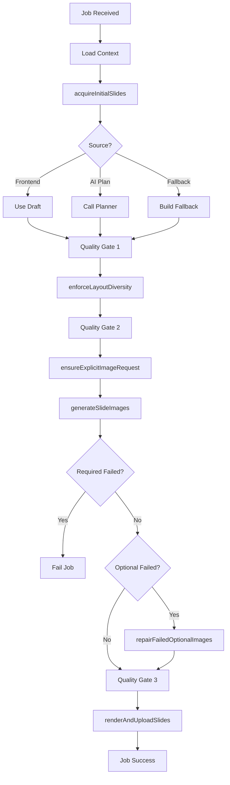

# SDUI Carousel Worker - Refactored Architecture

**Last Updated:** 2026-06-15  
**Status:** ✅ Sprint 4 Complete

---

## 📐 Architecture Overview

```
sdui-carousel-worker.ts (406 lines)
        │
        ├─ Orchestration Layer
        │  └─ processSduiCarouselJob()
        │
        └─ Module Dependencies
           │
           ├─ workers/utils/
           │  ├─ image-utils.ts          (145 lines)
           │  ├─ theme-builder.ts        (179 lines)
           │  ├─ content-sanitizer.ts    (165 lines)
           │  └─ slide-utils.ts          (118 lines)
           │
           ├─ workers/validators/
           │  ├─ slide-quality-validator.ts  (252 lines)
           │  └─ slide-content-analyzer.ts   (70 lines)
           │
           ├─ workers/processors/
           │  ├─ slide-enrichment.ts     (340 lines)
           │  ├─ layout-processor.ts     (355 lines)
           │  └─ slide-repair.ts         (309 lines)
           │
           └─ workers/pipeline/
              ├─ job-pipeline-context.ts     (110 lines)
              ├─ slide-acquisition.ts        (149 lines)
              ├─ quality-gate.ts             (144 lines)
              ├─ image-generation-handler.ts (344 lines)
              ├─ render-phase-handler.ts     (144 lines)
              └─ pipeline-error-handler.ts   (35 lines)
```

---

## 🔄 Pipeline Flow



---

## 📦 Module Responsibilities

### Utils Layer
**Purpose:** Pure functions, no external dependencies

- **image-utils.ts** - Canvas sizing, aspect ratio, image normalization
- **theme-builder.ts** - Brand kit → theme config transformation
- **content-sanitizer.ts** - Content tag application, conversation context
- **slide-utils.ts** - Slide metadata extraction, planner error mapping

### Validators Layer
**Purpose:** Quality checks, no mutations

- **slide-quality-validator.ts** - Content density, renderability, visual integrity
- **slide-content-analyzer.ts** - Text extraction, issue uniqueness, repair validation

### Processors Layer
**Purpose:** Slide transformations, mutations allowed

- **slide-enrichment.ts** - Sparse slide enrichment, fallback content generation
- **layout-processor.ts** - Layout variant selection, diversity enforcement
- **slide-repair.ts** - Quality repair orchestration (AI + deterministic)

### Pipeline Layer
**Purpose:** Phase orchestration, external calls

- **job-pipeline-context.ts** - Shared context types
- **slide-acquisition.ts** - Initial slide deck acquisition
- **quality-gate.ts** - Quality validation + repair gates
- **image-generation-handler.ts** - AI image generation + repair
- **render-phase-handler.ts** - Terminal render + upload
- **pipeline-error-handler.ts** - Planner error handling

---

## 🔌 Module Imports

### Worker Imports
```typescript
// Pipeline orchestration
import { acquireInitialSlides } from './workers/pipeline/slide-acquisition.js';
import { runQualityGate } from './workers/pipeline/quality-gate.js';
import { generateSlideImages, failJobForRequiredImageFailures } from './workers/pipeline/image-generation-handler.js';
import { renderAndUploadSlides } from './workers/pipeline/render-phase-handler.js';
import { failJobForPlannerError } from './workers/pipeline/pipeline-error-handler.js';

// Processors
import { LayoutProcessor } from './workers/processors/layout-processor.js';
import { SlideRepair } from './workers/processors/slide-repair.js';

// Utils
import { ImageUtils } from './workers/utils/image-utils.js';
import { ThemeBuilder } from './workers/utils/theme-builder.js';
import { SlideUtils } from './workers/utils/slide-utils.js';
```

### Pipeline Module Dependencies
```typescript
// quality-gate.ts
import { SlideRepair } from '../processors/slide-repair.js';
import { SlideQualityValidator } from '../validators/slide-quality-validator.js';
import { applyContentTags } from '../utils/content-sanitizer.js';

// slide-repair.ts
import { SlideEnrichment } from './slide-enrichment.js';
import { LayoutProcessor } from './layout-processor.js';
import { SlideQualityValidator } from '../validators/slide-quality-validator.js';

// image-generation-handler.ts
import { ImageUtils } from '../utils/image-utils.js';
import { SlideUtils } from '../utils/slide-utils.js';
import { LayoutProcessor } from '../processors/layout-processor.js';
import { SlideRepair } from '../processors/slide-repair.js';
```

---

## 🧪 Test Coverage

### Worker Tests (17 tests)
- ✅ Text-only carousel generation
- ✅ Image-aware workflow
- ✅ Optional image generation + repair
- ✅ Required image failure handling
- ✅ Overlong text truncation
- ✅ Sparse content enrichment
- ✅ Empty checklist fallback
- ✅ Missing image placeholder repair
- ✅ Header-only slide enrichment
- ✅ Incomplete body sentence repair
- ✅ Multi-image layout validation

### Module Tests
- ✅ Utils: 126/126 tests passing
- ✅ Validators: 80/80 tests passing
- ✅ Processors: 72/72 tests passing
- ✅ **Total: 295+ unit tests**

---

## 🎯 Design Principles

### 1. Single Responsibility
Each module has one clear purpose:
- Utils: pure transformation
- Validators: read-only checks
- Processors: slide mutations
- Pipeline: phase orchestration

### 2. Dependency Direction
```
Pipeline → Processors → Validators → Utils
   ↓           ↓            ↓
 (orchestrate) (mutate)   (validate)  (transform)
```

### 3. Fail-Fast
- Terminal errors stop pipeline immediately
- Repair attempts are bounded (AI → deterministic → fail)
- Quality gates at key checkpoints

### 4. Testability
- Pure functions in utils (easy to test)
- Validators have no side effects
- Processors are stateless transformations
- Pipeline phases can be tested in isolation

### 5. Type Safety
- Strong typing throughout
- No `any` casts (except controlled `as SduiCarouselWorkerDeps`)
- Explicit context interfaces
- Contract-based module boundaries

---

## 📈 Metrics & Benefits

### Before Refactor
- 989 lines in single file
- 30+ inline helper functions
- Mixed concerns (orchestration + logic)
- Difficult to test individual pieces
- High cognitive load for changes

### After Refactor
- 406 lines in worker (orchestrator only)
- 12 focused modules
- Clear separation of concerns
- Each module independently testable
- Easy to locate and modify logic

### Improvements
- **-58% main file size** (989 → 406 lines)
- **+12 modules** (organized by responsibility)
- **+295 unit tests** (utils/validators/processors)
- **Zero breaking changes** (17/17 tests passing)
- **Zero tech debt** (all TODOs resolved)

---

## 🚀 Future Extensibility

### Easy to Add
- New layout variants (LayoutProcessor)
- New quality validators (SlideQualityValidator)
- New enrichment strategies (SlideEnrichment)
- New pipeline phases (just insert before render)

### Easy to Test
- Mock individual phases
- Test repair strategies in isolation
- Validate layout logic independently
- Test quality gates separately

### Easy to Maintain
- Find logic by responsibility (utils vs validators vs processors)
- Change one module without touching others
- Add features without growing main worker
- Refactor internals without breaking pipeline

---

**Architecture Owner:** Development Team  
**Last Updated:** 2026-06-15 21:15 UTC  
**Status:** ✅ Production-Ready
